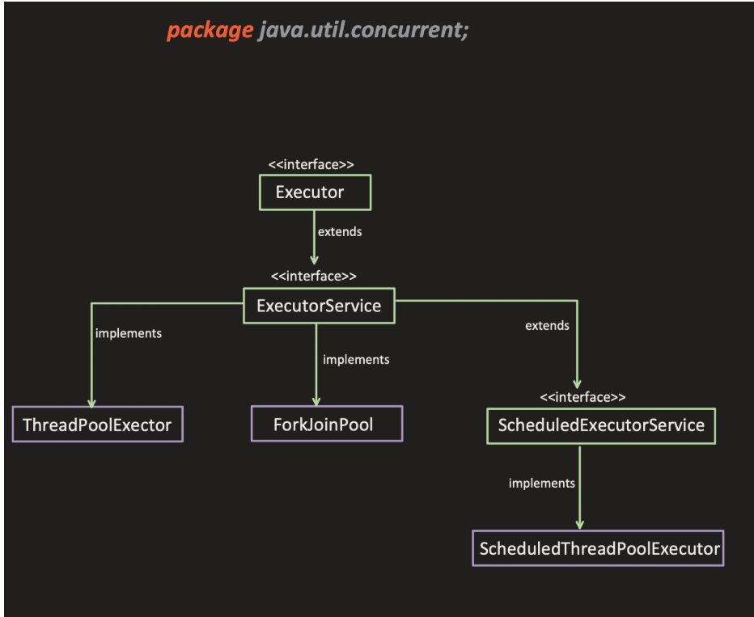

# Thread Pools in Java | ThreadPoolExecutor Framework

## 3. Executor Framework Architecture

### Overview

The instructor explains that Java provides a framework available in the `java.util.concurrent` package for managing thread pools. This framework has a hierarchical structure with interfaces and implementation classes.

---

### Framework Hierarchy
<p align="center">
  
</p>

---

### 3.1 Executor Interface (Top-Level Interface)

**Package:** `java.util.concurrent`

**Purpose:** The top-most interface in the executor framework hierarchy

#### Single Method
```java
void execute(Runnable task)
```

**Characteristics:**
- Has only **ONE method**: `execute()`
- Takes a `Runnable` task as parameter
- Simply executes whatever task you assign
- Very basic and minimal functionality

**What it does:**
- You pass a `Runnable` task
- It executes that task
- That's it - nothing more!

---

### 3.2 ExecutorService Interface

**Extends:** `Executor` interface

**Purpose:** Provides more methods and better management capabilities for thread pools

#### Key Difference from Executor

The instructor emphasizes:
> "Executor has only one execute method. ExecutorService provides some other functionalities apart from execute (which it extends from Executor)."

#### Additional Methods Provided

ExecutorService exposes many more methods for managing thread pools:

- **`shutdown()`** - Initiates an orderly shutdown
- **`shutdownNow()`** - Attempts to stop all actively executing tasks
- **`isShutdown()`** - Returns true if shutdown has been initiated
- **`isTerminated()`** - Returns true if all tasks completed after shutdown
- **`submit()`** - Submits tasks for execution
- And many more methods...

**Key Point:** ExecutorService provides complete lifecycle management of thread pools, not just execution.

**Functionality Overview:**
```
Executor:
- execute() only

ExecutorService (extends Executor):
- execute() [inherited]
- shutdown()
- shutdownNow()
- isShutdown()
- isTerminated()
- submit()
- invokeAll()
- invokeAny()
- ... and more
```

---

### 3.3 ThreadPoolExecutor Class

**Type:** Concrete implementation class (NOT an interface)

**Implements:** `ExecutorService` interface

**Purpose:** The main implementation for creating customizable thread pools

#### Key Characteristics

The instructor emphasizes these points:

1. **It's a CLASS, not an interface**
    - `Executor` is an interface
    - `ExecutorService` is an interface
    - `ThreadPoolExecutor` is a **concrete class**

2. **Implements ExecutorService**
    - Provides actual implementation of all ExecutorService methods
    - Concrete implementation of thread pool behavior

3. **Highly Customizable**
    - Allows you to create customized thread pools
    - Most configurable option available
    - Can fine-tune every aspect of thread pool behavior

4. **Most Important for Understanding**
    - This is the **focus of today's lecture**
    - Understanding ThreadPoolExecutor helps understand thread pool internals
    - Most commonly used for custom thread pool creation

**The instructor says:**
> "So today I will cover the ThreadPoolExecutor. Very, very important. ThreadPoolExecutor - it helps to create a customizable thread pool."

---

### 3.4 ForkJoinPool Class

**Type:** Concrete implementation class

**Implements:** `ExecutorService` interface

**Purpose:** Specialized executor for work-stealing algorithm and parallel processing

#### Characteristics

- Implements `ExecutorService`
- Uses work-stealing algorithm
- Designed for divide-and-conquer tasks
- Good for recursive task splitting
- Optimized for parallel processing

**Note:** The instructor mentions this briefly but doesn't go into detail as it's not the focus of today's lecture.

---

### 3.5 ScheduledExecutorService Interface

**Type:** Interface

**Extends:** `ExecutorService` interface

**Purpose:** Provides functionality for scheduling tasks

#### Key Features

The instructor explains:
> "This extended this, provides a functionality of running a thread on a particular time - scheduled."

**Capabilities:**
- Schedule tasks to run at specific times
- Schedule tasks to run after a delay
- Schedule tasks to run periodically
- Fixed-rate execution
- Fixed-delay execution

**Implementation Class:** `ScheduledThreadPoolExecutor`

**Note:** The instructor mentions:
> "We will come to this, so we will see each one of them separately."

This will be covered in future sessions.

---

### Summary of Framework Components

| Component | Type | Purpose | Key Feature |
|-----------|------|---------|-------------|
| **Executor** | Interface | Basic task execution | Single `execute()` method |
| **ExecutorService** | Interface | Complete pool management | Lifecycle management methods |
| **ThreadPoolExecutor** | Class | Customizable thread pool | Highly configurable implementation |
| **ForkJoinPool** | Class | Work-stealing executor | Divide-and-conquer tasks |
| **ScheduledExecutorService** | Interface | Scheduled execution | Time-based task scheduling |

---

### Why ThreadPoolExecutor is the Focus

The instructor makes it clear why today's lecture focuses on ThreadPoolExecutor:

1. **Most Important** - Understanding it helps understand thread pool internals
2. **Highly Customizable** - Allows fine-grained control over thread pool behavior
3. **Most Commonly Used** - Used in production for custom thread pool requirements
4. **Foundation Knowledge** - Understanding this helps understand other executors

**Instructor's emphasis:**
> "So today I will cover the thread pool executor. Very very important right. Thread pool executor."

---

### Visual Representation
```
┌─────────────────────────────────────────────────────┐
│           java.util.concurrent Package              │
│                                                     │
│  ┌──────────────────────────────────────────┐     │
│  │      Executor (Interface)                │     │
│  │      • execute(Runnable)                 │     │
│  └──────────────┬───────────────────────────┘     │
│                 │                                  │
│  ┌──────────────▼───────────────────────────┐     │
│  │   ExecutorService (Interface)            │     │
│  │   • shutdown()                           │     │
│  │   • shutdownNow()                        │     │
│  │   • submit()                             │     │
│  │   • isTerminated()                       │     │
│  └──────┬──────────────┬───────────────┬────┘     │
│         │              │               │          │
│  ┌──────▼─────┐ ┌─────▼─────┐  ┌─────▼──────────┐│
│  │ThreadPool  │ │ ForkJoin  │  │  Scheduled     ││
│  │Executor    │ │   Pool    │  │ExecutorService ││
│  │  (Class)   │ │  (Class)  │  │  (Interface)   ││
│  └────────────┘ └───────────┘  └────────────────┘│
│                                                    │
│  ← Today's Focus                                   │
└────────────────────────────────────────────────────┘
```

---

### What's Next?

The instructor will now dive deep into **ThreadPoolExecutor**:
- Constructor parameters
- Configuration options
- How it works internally
- Practical examples

> "Now let's first understand the process. Or you can say that the flow. Let's first understand the flow."

---