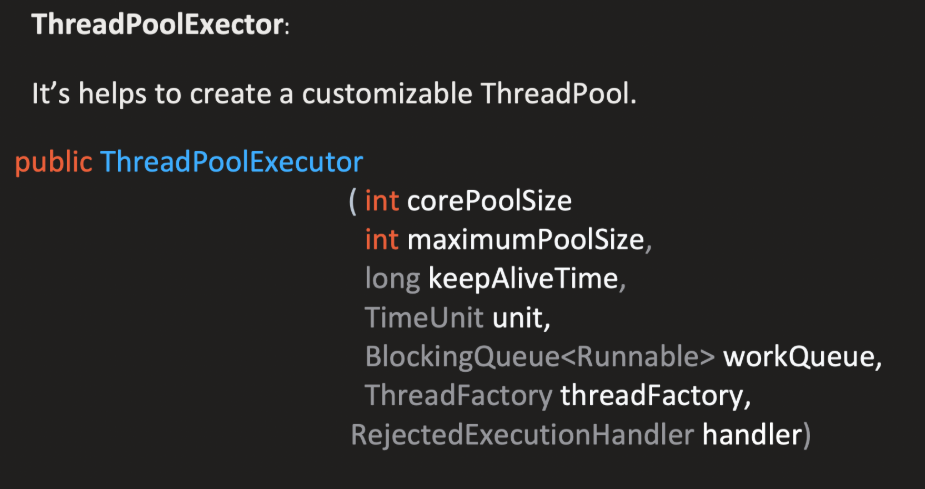

# Thread Pools in Java | ThreadPoolExecutor Framework

## 5. ThreadPoolExecutor Constructor Parameters

### Overview

Now that we understand the execution flow, the instructor dives deep into the ThreadPoolExecutor constructor and its parameters. Understanding these parameters is crucial for configuring thread pools correctly.

---

## 5.1 ThreadPoolExecutor Constructor

<p align="center">
  
</p>

### Constructor Signature
```
public ThreadPoolExecutor(
    int corePoolSize,
    int maximumPoolSize,
    long keepAliveTime,
    TimeUnit unit,
    BlockingQueue<Runnable> workQueue,
    ThreadFactory threadFactory,
    RejectedExecutionHandler handler
)
```

The instructor emphasizes:
> "So here in the thread pool executor, if we see this is the constructor. So this is the constructor. If you see that it has lot of parameters. So we will see what is the meaning or purpose of each parameter which we have to be clear very thoroughly. Because these are mostly the configuration which help us to create a thread pool."

---

## 5.2 Parameter 1: corePoolSize

### Definition

**corePoolSize:** The number of threads that are initially created and kept in the pool even if they are idle.

### Explanation

The instructor explains:
> "Core pool size means the number of threads are initially created and keep in the pool even if they are idle."

**What does this mean?**

If you set `corePoolSize = 3`:
```
Thread Pool at initialization:
[Thread 1] [Thread 2] [Thread 3]
```

**Key Characteristics:**

1. **Initially Created**
    - These threads are created when the thread pool is initialized
    - They are pre-created and ready to work

2. **Always Present**
    - These threads will **always be available** in the thread pool
    - Minimum number of threads that should exist

3. **Even if Idle**
    - Even if these threads are not processing anything
    - Even if they are sitting idle with no tasks
    - They will **keep on waiting** in the thread pool
    - They will **NOT be terminated**

### Visual Representation
```
corePoolSize = 3

Thread Pool:
┌─────────────────────────────────────┐
│  [Thread 1]  [Thread 2]  [Thread 3]    │  ← Always present
│     IDLE        IDLE        IDLE       │  ← Even when idle
└─────────────────────────────────────┘
```

---

## 5.3 Related Property: allowCoreThreadTimeOut

### Introduction

The instructor introduces an important related property:

**Note:** This is **NOT a constructor parameter**, but a property that can be set on the ThreadPoolExecutor object.
```java
boolean allowCoreThreadTimeOut
```

### Purpose

The instructor explains a specific use case:

> "I told you that whatever the core pool size you have set, it will create that many threads in the pool. And even if they are idle [they stay]. But if your requirement is that, hey, if they are idle for a specific time, then remove them, then delete those, or you can say that terminate those threads."

### How It Works

**Default Behavior (allowCoreThreadTimeOut = false):**
```
Core threads remain alive forever, even if idle
```

**Modified Behavior (allowCoreThreadTimeOut = true):**
```
Core threads can be terminated if idle for keepAliveTime duration
```

### Setting the Property
```java
ThreadPoolExecutor executor = new ThreadPoolExecutor(...);
executor.allowCoreThreadTimeOut(true);  // Enable core thread timeout
```

### Relationship with keepAliveTime

The instructor explains:
> "If this property is set to true, then idle threads are kept alive till time specified by keepAliveTime."

**Important Note:** This property works in conjunction with the `keepAliveTime` parameter (which we'll see next).

---

## 5.4 Parameter 2: keepAliveTime

### Definition

**keepAliveTime:** The maximum time that idle threads are kept alive before being terminated.

### Explanation
```java
long keepAliveTime
```

The instructor explains:
> "Keep alive time - thread which are idle, get terminated after this time."

### How It Works

**Example:** `keepAliveTime = 5`
```
Thread is idle for 1 second  → Still alive ✓
Thread is idle for 2 seconds → Still alive ✓
Thread is idle for 3 seconds → Still alive ✓
Thread is idle for 4 seconds → Still alive ✓
Thread is idle for 5 seconds → Still alive ✓
Thread is idle for MORE than 5 seconds → Terminated ❌
```

### Critical Condition

The instructor emphasizes an important point:
> "And this will be only used if allowCoreThreadTimeOut is set to true."

**Scenarios:**

**Scenario 1: allowCoreThreadTimeOut = false (default)**
```
keepAliveTime = 5 seconds
allowCoreThreadTimeOut = false

Result:
- Core threads remain alive FOREVER
- keepAliveTime has NO EFFECT on core threads
- Even if idle for 5 seconds, 1 minute, 1 hour - threads stay alive
```

**Scenario 2: allowCoreThreadTimeOut = true**
```
keepAliveTime = 5 seconds
allowCoreThreadTimeOut = true

Result:
- Idle threads are kept alive for 5 seconds
- After 5 seconds of being idle → Thread is terminated
- keepAliveTime is NOW EFFECTIVE
```

### Important Note

The instructor clarifies:
> "Even if you have set this five second. But this is by default false. And if you haven't made it true. This parameter is of no use. All three threads will remain active even if they are idle."

### Applicability

**Which threads does keepAliveTime apply to?**

By default (allowCoreThreadTimeOut = false):
- Applies only to **extra threads** (threads created beyond core pool size)
- Does NOT apply to core threads

When allowCoreThreadTimeOut = true:
- Applies to **ALL threads** including core threads

---

## 5.5 Parameter 3: unit (TimeUnit)

### Definition

**unit:** Specifies the time unit for the keepAliveTime parameter.
```java
TimeUnit unit
```

### Purpose

The instructor explains:
> "Here this keep alive time you are giving like long. It's like you can give 5, 10. Now what does it mean? Five seconds, five hours, five minutes, what does it mean? So in the time unit we can tell."

### Problem It Solves
```java
keepAliveTime = 5  // What does 5 mean?
                   // 5 seconds?
                   // 5 minutes?
                   // 5 hours?
                   // 5 milliseconds?
```

### TimeUnit Options
```java
TimeUnit.MILLISECONDS  // 5 milliseconds
TimeUnit.SECONDS       // 5 seconds
TimeUnit.MINUTES       // 5 minutes
TimeUnit.HOURS         // 5 hours
TimeUnit.DAYS          // 5 days
```

### Examples

**Example 1:**
```java
keepAliveTime = 5
unit = TimeUnit.SECONDS

Meaning: Thread will be terminated after 5 SECONDS of being idle
```

**Example 2:**
```java
keepAliveTime = 10
unit = TimeUnit.MINUTES

Meaning: Thread will be terminated after 10 MINUTES of being idle
```

**Example 3:**
```java
keepAliveTime = 300
unit = TimeUnit.MILLISECONDS

Meaning: Thread will be terminated after 300 MILLISECONDS of being idle
```

### Summary

The instructor summarizes:
> "So if you're telling keep alive time is five (because it's a long), then time unit will say that okay, you can tell minute. Okay, five minutes. So after five minutes, if any thread is idle and if this property is set to true, that thread will be eliminated."
```
keepAliveTime (long) + TimeUnit = Complete Time Specification
      5          +    MINUTES   =  5 minutes
      10         +    SECONDS   =  10 seconds
      300        + MILLISECONDS =  300 milliseconds
```

---

## 5.6 Parameter 4: maximumPoolSize

### Definition

**maximumPoolSize:** The maximum number of threads that can exist in the pool at any given time.
```java
int maximumPoolSize
```

### When Does It Come Into Picture?

The instructor has already explained this through the flow. Let's recap:

**Scenario:**
```
Configuration:
- corePoolSize (minimum): 3
- maximumPoolSize: 5
- Queue size: 4
```

### Execution Flow Recap

**Step 1: Core threads handling tasks**
```
Task 1, 2, 3 → Thread 1, 2, 3 (all core threads BUSY)
```

**Step 2: Queue filling up**
```
Task 4, 5, 6, 7 → Queue [Task 4] [Task 5] [Task 6] [Task 7]
All core threads BUSY, Queue FULL (size = 4)
```

**Step 3: maximumPoolSize comes into picture**
```
Task 8 arrives:
├─> All core threads (3) busy? YES
├─> Queue full? YES
├─> Maximum threads allowed: 5
├─> Current threads in pool: 3
└─> Can create more? YES (5 - 3 = 2 more allowed)

Action: Create Thread 4, assign Task 8
```

**Step 4: Creating up to maximum**
```
Task 9 arrives:
├─> Create Thread 5, assign Task 9
└─> Now 5 threads exist (MAXIMUM reached)
```

**Step 5: Maximum reached - Rejection**
```
Task 10 arrives:
├─> All 5 threads busy? YES
├─> Queue full? YES
├─> Can create more threads? NO (already at maximum)
└─> Action: REJECT Task 10
```

### Key Understanding

The instructor emphasizes:
> "Maximum pool size I am telling five, okay. So I have already told you the flow."

**Maximum Pool Size determines:**
- The absolute maximum number of threads that can exist
- Once reached, no more threads can be created
- Tasks will be rejected if all conditions met (threads busy, queue full, max reached)

---

## 5.7 Understanding: Why Queue Before Maximum Threads?

### The Question

The instructor addresses an important question:
> "But now one question you can ask to me, that is why we first put into the queue. Why not when the task four is coming, why we first put into the queue when all three are busy? Why not we first create a four?"

**Scenario in Question:**
```
Core threads: 3 (all BUSY)
Maximum: 5 (we can create 2 more)
Task 4 arrives

Question: Why put Task 4 in queue?
Why not immediately create Thread 4?
```

### The Reasoning

The instructor provides reasoning:

**If we created threads immediately (hypothetical):**
```
Task 1, 2, 3 → Thread 1, 2, 3 (core threads, all BUSY)
Task 4 arrives → Create Thread 4 (instead of queue)
Task 5 arrives → Create Thread 5 (instead of queue)

Now: [Thread 1-BUSY] [Thread 2-BUSY] [Thread 3-BUSY] 
     [Thread 4-BUSY] [Thread 5-BUSY]

All 5 threads created (maximum reached)
```

**Problem after tasks complete:**
```
Thread 4 completes Task 4 → Returns to pool (IDLE)
Thread 5 completes Task 5 → Returns to pool (IDLE)

Thread Pool: [Thread 1] [Thread 2] [Thread 3] [Thread 4] [Thread 5]
                                                ↑          ↑
                                            Sitting idle
```

### The Core Issue

The instructor explains:
> "Now your thread pool will be like kind of full. Like you have all the threads created. And whatever the minimum pool size I have created, I have created in mind that most average, on an average, this many threads are sufficient to fulfill most of the requests."

**Design Philosophy:**

1. **Core Pool Size = Average Load**
```
   corePoolSize = 3 means:
   "On average, 3 threads are sufficient for most requests"
```

2. **Queue = Buffer for Temporary Peaks**
```
   Queue handles temporary spikes in load
   Core threads process queue when available
```

3. **Maximum Pool Size = Extreme Peak Handling**
```
   Only for rare, extreme scenarios
   When even queue can't handle the load
```

### Why This Design?

**Reason 1: Avoid Unnecessary Thread Creation**
```
If we create threads eagerly:
- Thread 4 and Thread 5 created
- They complete tasks quickly
- Now sitting IDLE in pool
- But on average, only 3 threads needed
- Thread 4 and Thread 5 unnecessarily occupying resources
```

**Reason 2: Most Use Cases Fulfilled by Core + Queue**
```
Average scenario:
Core threads (3) + Queue → Handles most requests efficiently

Peak scenario:
Core threads (3) + Queue + Extra threads (2) → Handles extreme peaks
```

The instructor's reasoning:
> "That's one of my reasoning, is that that's why we first try to utilize a queue. And with this minimum number itself, minimum thread itself, we will first try to complete all the requests with the help of queue and this minimum threads."

### Summary of Strategy
```
┌─────────────────────────────────────────────────┐
│            Thread Creation Strategy                 │
├─────────────────────────────────────────────────┤
│                                                     │
│  Normal Load → Use Core Threads (always ready)      │
│                                                     │
│  Slight Peak → Use Queue (buffer for tasks)         │
│                                                     │
│  Extreme Peak → Create Additional Threads           │
│                 (up to maximum)                     │
│                                                     │
│  Beyond Max → Reject (can't handle more)            │
│                                                     │
└─────────────────────────────────────────────────┘
```

**Design Goal:**
> "This is one of the reason why it has been designed that way. First whatever the minimum threads is used, if that is full, try to put in queue because that's where our most of the use cases get fulfilled. Only in certain scenario when the sudden peak comes, all our pool size finished, all our queue finished, then only go and utilize the max thread because we don't want to reject the request."

---

## 5.9 Parameter 5: workQueue (BlockingQueue)

### Definition

**workQueue:** A BlockingQueue used to hold tasks before they are picked up by worker threads.
```java
BlockingQueue<Runnable> workQueue
```

### Purpose

The instructor explains:
> "This work queue is a blocking queue. I have already told you this queue is used to hold tasks before they got picked up by the worker thread."

**Visual Representation:**
```
Tasks waiting → Queue [Task 4] [Task 5] [Task 6] → Worker threads pick from here
```

---

### Types of BlockingQueue

The instructor categorizes queues into two main types:

#### 1. Bounded Queue

**Definition:** Queue with a **fixed capacity**

**Example:** `ArrayBlockingQueue`
```java
BlockingQueue<Runnable> queue = new ArrayBlockingQueue<>(4);
// Queue size = 4 (fixed)
```

**Characteristics:**
- Fixed capacity (like array)
- Cannot grow beyond specified size
- Example from earlier: Queue size = 4
```
  Queue: [Task 4] [Task 5] [Task 6] [Task 7]
         └─ 1 ──┘ └─ 2 ──┘ └─ 3 ──┘ └─ 4 ──┘
  FULL! Cannot add more.
```

---

#### 2. Unbounded Queue

**Definition:** Queue with **no fixed capacity**

**Example:** `LinkedBlockingQueue`
```java
BlockingQueue<Runnable> queue = new LinkedBlockingQueue<>();
// No size limit (like linked list)
```

**Characteristics:**
- No fixed capacity
- Can grow indefinitely
- Like a linked list - keeps adding nodes
- Any number of tasks can be put in queue

**Example:**
```
Queue: [Task 1] → [Task 2] → [Task 3] → ... → [Task 1000] → ...
       Can keep growing indefinitely
```

---

### Which One to Use?

The instructor provides clear guidance:

**Preferred: Bounded Queue ✓**
> "Generally this one is preferred. Bounded queue. Unbounded queue, it's generally should be avoided. And bounded queue is mostly preferred because we want full control. How much request can be put in a queue."

**Why Bounded Queue?**
1. **Full Control** - You control exactly how many tasks can wait
2. **Resource Management** - Prevents memory overflow
3. **Predictable Behavior** - Know the limits of your system

**Why Avoid Unbounded Queue?**
1. **No Control** - Queue can grow indefinitely
2. **Memory Risk** - Could lead to OutOfMemoryError
3. **Unpredictable** - Don't know when system will fail

---

### How Tasks Are Processed from Queue

The instructor reminds us:
> "And here task is capped and your worker thread will pick from this task as soon as they get free."

**Flow:**
```
Queue: [Task 4] [Task 5] [Task 6]

Thread 1 completes current task
    ↓
Thread 1 returns to pool
    ↓
Thread 1 checks queue
    ↓
Thread 1 picks Task 4
    ↓
Queue: [Task 5] [Task 6]
```

**Task gets picked up by the worker thread from the queue.**

---

## 5.10 Parameter 6: threadFactory (ThreadFactory)

### Definition

**threadFactory:** An interface that provides a way to customize thread creation.
```java
ThreadFactory threadFactory
```

### Purpose

The instructor explains what ThreadFactory allows you to customize:
> "What does thread factory means? So thread factory means it gives you an interface where you can give custom thread name, thread priority, and the daemon flag."

**What can you customize?**
1. **Thread Name** - Custom naming for your threads
2. **Thread Priority** - Set priority for thread execution
3. **Daemon Flag** - Whether thread is daemon or not

---

### Why Do We Need ThreadFactory?

**Default Behavior:**

The instructor explains:
> "You know that this framework itself will create the thread pool. Executor itself will create a thread. So it will give the thread name of its own. It gives the thread priority of its own. And if you want thread daemon or not, by default it is false. It will give on its own."
```
Without custom ThreadFactory:
- Thread names: pool-1-thread-1, pool-1-thread-2, etc. (default)
- Thread priority: NORM_PRIORITY (default)
- Daemon: false (default)
```

**With Custom ThreadFactory:**

> "But if you want to override that property, you can provide your own thread factory. And you can tell like what is the thread name I want to give? What is the thread priority I want to give? Whether this thread is a daemon flag daemon or not, you can set those."
```
With custom ThreadFactory:
- Thread names: MyApp-Worker-1, MyApp-Worker-2 (custom)
- Thread priority: MAX_PRIORITY (custom)
- Daemon: true (custom)
```

---

### Custom ThreadFactory Example

**Creating Custom ThreadFactory:**
```java
class MyCustomThreadFactory implements ThreadFactory {
    
    @Override
    public Thread newThread(Runnable r) {
        // Create thread with the runnable task
        Thread thread = new Thread(r);
        
        // Set custom properties
        thread.setPriority(Thread.NORM_PRIORITY);  // Set priority
        thread.setDaemon(false);                   // Set daemon flag
        thread.setName("MyCustomThread");          // Set custom name
        
        return thread;
    }
}
```

**Usage:**
```java
ThreadFactory factory = new MyCustomThreadFactory();

ThreadPoolExecutor executor = new ThreadPoolExecutor(
    2,                          // corePoolSize
    4,                          // maximumPoolSize
    10,                         // keepAliveTime
    TimeUnit.MINUTES,           // unit
    new ArrayBlockingQueue<>(2),// workQueue
    factory,                    // threadFactory ← Custom factory
    handler                     // rejection handler
);
```

---

### Benefits of Custom ThreadFactory

1. **Better Debugging**
    - Custom thread names help identify threads in logs
    - Example: "OrderProcessing-Thread-1" vs "pool-1-thread-1"

2. **Priority Control**
    - Set different priorities for different thread pools
    - Critical tasks can have higher priority threads

3. **Daemon Control**
    - Control whether threads should keep JVM alive
    - Daemon threads don't prevent JVM shutdown

---

## 5.11 Parameter 7: handler (RejectedExecutionHandler)

### Definition

**handler:** Defines what to do when a task cannot be accepted by the thread pool.
```java
RejectedExecutionHandler handler
```

### When Is This Used?

The instructor recalls the rejection scenario:
> "I told you that queue is full. All queue is full. Thread pool is full."

**Rejection Conditions:**
```
Scenario:
- Thread 1: BUSY
- Thread 2: BUSY  
- Thread 3: BUSY
- Thread 4: BUSY
- Thread 5: BUSY (Maximum = 5, all created)
- Queue: FULL

New task arrives → What to do? → REJECT

Handler: Defines HOW to handle this rejection
```

---

### Purpose

The instructor explains:
> "It is a handler for the task that cannot be accepted by the thread pool."

**Common Use Case:**
> "Generally what we do is we do logging here in this case that this task is rejected. So we can put a log here for debugging purpose."

---

### Built-in Rejection Handlers

Java provides **4 built-in handlers**:

---

#### 1. AbortPolicy (Default)

**Class:** `ThreadPoolExecutor.AbortPolicy`

**Behavior:** Throws an exception when task is rejected

The instructor explains:
> "This is the abort policy rejected execution handler. This is the abort policy. What it will do is it will simply throw an exception. Whenever any task is rejected, it will throw an exception that hey, rejected execution exception."

**Code:**
```java
RejectedExecutionHandler handler = new ThreadPoolExecutor.AbortPolicy();
```

**What happens:**
```
Task rejected → Throws RejectedExecutionException
```

**Use Case:** When you want to know immediately that a task was rejected and handle it explicitly

---

#### 2. DiscardPolicy

**Class:** `ThreadPoolExecutor.DiscardPolicy`

**Behavior:** Silently discards the rejected task without any notification

The instructor explains:
> "Let's see this discard policy that silently discard the rejected without throwing any exception. If you are using this handler, and any task is rejected, you won't know. It just simply discarded it."

**Code:**
```java
RejectedExecutionHandler handler = new ThreadPoolExecutor.DiscardPolicy();
```

**What happens:**
```
Task rejected → Silently dropped (no exception, no notification)
```

**Use Case:** When rejected tasks are not critical and can be safely ignored

**Warning:** Dangerous if you need to track all tasks!

---

#### 3. CallerRunsPolicy

**Class:** `ThreadPoolExecutor.CallerRunsPolicy`

**Behavior:** Executes the rejected task in the caller's thread (the thread that submitted the task)

The instructor explains:
> "What it will do is execute the rejected task in the caller's thread. Thread that attempted to submit the task."

**Understanding Caller's Thread:**
```
Main Thread (or any thread) submits task
         ↓
    Thread Pool Executor
         ↓
    All threads busy + Queue full
         ↓
    Task rejected
         ↓
    CallerRunsPolicy activated
         ↓
    Task runs in Main Thread (the caller)
```

**Code:**
```java
RejectedExecutionHandler handler = new ThreadPoolExecutor.CallerRunsPolicy();
```

**What happens:**
```
Main thread submits Task X
    ↓
Task X rejected (pool full)
    ↓
Task X runs in Main thread itself (not in pool)
```

**Use Case:**
- Provides a throttling mechanism
- Slows down the submitting thread
- Ensures task is not lost

**Example:**
```java
// Main thread
executor.submit(task);  // If rejected, task runs in main thread
```

---

#### 4. DiscardOldestPolicy

**Class:** `ThreadPoolExecutor.DiscardOldestPolicy`

**Behavior:** Discards the oldest task in the queue to make room for the new task

The instructor explains:
> "Discard the oldest task in the queue to accommodate the new task. So if you have used this, what it will do is that it will see that hey, what is the oldest task in this queue? It will discard that and put this new task in it."

**Visual Example:**
```
Queue (FIFO): [Task 4] [Task 5] [Task 6] [Task 7]
               ↑ Oldest              Newest ↑

New Task 8 arrives (rejected)
    ↓
DiscardOldestPolicy activated
    ↓
Remove Task 4 (oldest)
    ↓
Add Task 8
    ↓
Queue: [Task 5] [Task 6] [Task 7] [Task 8]
```

**Code:**
```java
RejectedExecutionHandler handler = new ThreadPoolExecutor.DiscardOldestPolicy();
```

**Use Case:**
- When newer tasks are more important than older ones
- Real-time systems where latest data matters most
- Example: Live data feeds, sensor readings

---

### Creating Custom Rejection Handler

The instructor shows how to create a custom handler:

**Custom Handler Example:**
```java
class CustomHandler implements RejectedExecutionHandler {
    
    @Override
    public void rejectedExecution(Runnable r, ThreadPoolExecutor executor) {
        // Custom logic here
        System.out.println("Task rejected: " + r.toString());
        
        // Can log to file, database, monitoring system, etc.
        // Can access executor information
        System.out.println("Executor: " + executor.toString());
    }
}
```

**Usage:**
```java
RejectedExecutionHandler handler = new CustomHandler();

ThreadPoolExecutor executor = new ThreadPoolExecutor(
    2, 4, 10, TimeUnit.MINUTES,
    new ArrayBlockingQueue<>(2),
    threadFactory,
    handler  // Custom handler
);
```

**What information is available?**

The instructor mentions:
> "This is the task. And this is the executor which tried to perform this task. So I can use this information. What is the name and all. You can print that one for your debugging purpose."

**Available Information:**
```java
r.toString()              // Task information
executor.getPoolSize()    // Current pool size
executor.getQueue()       // Queue information
executor.getActiveCount() // Active thread count
// And more...
```

---

### Comparison of Rejection Handlers

| Handler | Behavior | Exception Thrown? | Task Lost? | Use Case |
|---------|----------|-------------------|------------|----------|
| **AbortPolicy** | Throws exception | ✓ Yes | ✓ Yes | Critical tasks, need to know about rejection |
| **DiscardPolicy** | Silently drops | ✗ No | ✓ Yes | Non-critical tasks, can afford to lose |
| **CallerRunsPolicy** | Runs in caller thread | ✗ No | ✗ No | Throttling, ensure all tasks execute |
| **DiscardOldestPolicy** | Drops oldest task | ✗ No | ✓ Yes (oldest) | Latest data more important |

---

## 5.12 Complete Constructor Summary

### All Parameters Together
```java
ThreadPoolExecutor executor = new ThreadPoolExecutor(
    int corePoolSize,              // Minimum threads always in pool
    int maximumPoolSize,           // Maximum threads allowed
    long keepAliveTime,            // Idle time before thread termination
    TimeUnit unit,                 // Time unit for keepAliveTime
    BlockingQueue<Runnable> workQueue,  // Queue to hold tasks
    ThreadFactory threadFactory,   // Custom thread creation
    RejectedExecutionHandler handler    // Handle rejected tasks
);
```

---

### Updated Summary Table

| Parameter | Type | Purpose | Key Points | Default/Recommendation |
|-----------|------|---------|------------|------------------------|
| **corePoolSize** | int | Minimum threads always in pool | Created at init, never terminated (by default) | Based on average load |
| **allowCoreThreadTimeOut** | boolean | Allow core threads to timeout | Property, not parameter | Default: false |
| **keepAliveTime** | long | Idle time before termination | Only effective if allowCoreThreadTimeOut = true | Depends on use case |
| **unit** | TimeUnit | Time unit for keepAliveTime | SECONDS, MINUTES, HOURS, etc. | Usually MINUTES or SECONDS |
| **maximumPoolSize** | int | Maximum threads allowed | Hard limit, for extreme peaks | >= corePoolSize |
| **workQueue** | BlockingQueue | Holds tasks before execution | Bounded (recommended) vs Unbounded | ArrayBlockingQueue (bounded) |
| **threadFactory** | ThreadFactory | Customize thread creation | Name, priority, daemon flag | Default or custom for debugging |
| **handler** | RejectedExecutionHandler | Handle rejected tasks | 4 built-in + custom options | AbortPolicy (default) |

---

**Next Section:** The instructor will cover the **ThreadPoolExecutor Lifecycle** (RUNNING, SHUTDOWN, STOP, TERMINATED states). Ready to continue? 😊

---