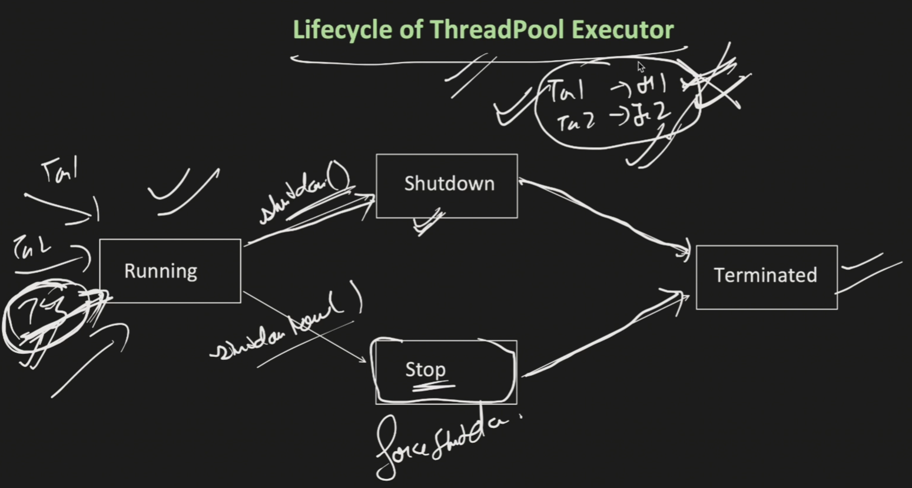

## 6. ThreadPoolExecutor Lifecycle

### Overview

The instructor now explains the different states (phases) of a ThreadPoolExecutor's lifecycle. Understanding these states is crucial for properly managing thread pools in production applications.

---

<p align="center">
  
</p>

---

## 6.1 Lifecycle States Diagram
```
    RUNNING
       ↓
    shutdown()
       ↓
    SHUTDOWN
       ↓
   (tasks complete)
       ↓
   TERMINATED

   OR

    RUNNING
       ↓
   shutdownNow()
       ↓
     STOP
       ↓
   TERMINATED
```

---

## 6.2 State 1: RUNNING

### Definition

**RUNNING:** The executor is in an active state and can accept new tasks.

### Characteristics

The instructor explains:
> "In the running, executor is in running state means submit method will be used to add new task. Means it can accept new task."

**Key Points:**

1. **Can Accept New Tasks** ✓
```java
   executor.submit(task1);  // Accepted
   executor.submit(task2);  // Accepted
   executor.submit(task3);  // Accepted
```

2. **Actively Processing Tasks** ✓
```
   Thread Pool: [Thread 1-BUSY] [Thread 2-BUSY] [Thread 3-BUSY]
   Queue: [Task 4] [Task 5]
   
   State: RUNNING - Everything working normally
```

3. **Normal Operation State**
    - Default state when thread pool is created
    - Can submit tasks using `submit()` or `execute()` methods
    - Threads are processing tasks from queue

---

### Visual Representation
```
┌─────────────────────────────────────────┐
│         RUNNING STATE                       │
├─────────────────────────────────────────┤
│                                             │
│  New tasks → Accepted ✓                     │
│                                             │
│  Thread Pool: [T1] [T2] [T3]                │
│               BUSY BUSY BUSY                │
│                                             │
│  Queue: [Task 4] [Task 5] [Task 6]          │
│                                             │
│  Status: Fully operational                  │
│                                             │
└─────────────────────────────────────────┘
```

---

## 6.3 State 2: SHUTDOWN

### Transition to SHUTDOWN

**How to enter SHUTDOWN state:**
```java
executor.shutdown();  // Call this method
```

### Definition

**SHUTDOWN:** Executor stops accepting new tasks but continues processing existing tasks.

### Characteristics

The instructor explains:
> "Let's say that if on this running, if you have called the shutdown. So there is a method called shutdown. What it will do is shutdown is now executed. Do not accept any new task but continue to process the existing task."

---

### Behavior in SHUTDOWN State

**Scenario:**
```
Initial State (RUNNING):
- Thread 1: Processing Task 1 (BUSY)
- Thread 2: Processing Task 2 (BUSY)
- Queue: [Task 3] [Task 4]

executor.shutdown() is called
    ↓
State changes to SHUTDOWN
```

**What happens:**

1. **No New Tasks Accepted** ✗
```java
   executor.submit(task5);  // Will be REJECTED
   // Throws RejectedExecutionException
```

2. **Existing Tasks Continue** ✓
```
   Thread 1: Continues processing Task 1 ✓
   Thread 2: Continues processing Task 2 ✓
   Queue: [Task 3] [Task 4] - Will be processed ✓
```

3. **Graceful Shutdown**
    - Allows currently running tasks to complete
    - Processes all tasks in the queue
    - Once all tasks complete → moves to TERMINATED

---

### Visual Representation
```
┌─────────────────────────────────────────┐
│         SHUTDOWN STATE                      │
├─────────────────────────────────────────┤
│                                             │
│  New Task 5 → REJECTED ✗                    │
│                                             │
│  Thread Pool: [T1] [T2]                     │
│               BUSY BUSY                     │
│               (continuing...)               │
│                                             │
│  Queue: [Task 3] [Task 4]                   │
│         (will be processed)                 │
│                                             │
│  After all complete → TERMINATED            │
│                                             │
└─────────────────────────────────────────┘
```

---

### Complete Flow in SHUTDOWN

The instructor's explanation:
> "So now let's say that Task 1, Task 2 is already running by Thread 1, Thread 2. But when shutdown is called now in thread executor, it will not accept any new task. Let's say Task 3 wants to submit now. It will not accept because now the thread executor is in shutdown mode. It will not accept any new thread, but it will let these two tasks to continue to process it. And once these two tasks complete, done, it slowly moves to the terminated state where all the threads will get eliminated."

**Step by Step:**
```
Step 1: Call shutdown()
    ↓
Step 2: Reject any new task submissions
    ↓
Step 3: Continue processing Task 1, Task 2 (currently running)
    ↓
Step 4: Process Task 3, Task 4 from queue
    ↓
Step 5: All tasks completed
    ↓
Step 6: Move to TERMINATED state
    ↓
Step 7: All threads eliminated
```

---

## 6.4 State 3: STOP

### Transition to STOP

**How to enter STOP state:**
```java
executor.shutdownNow();  // Forceful shutdown
```

### Definition

**STOP:** Force shutdown - stops accepting new tasks AND forcefully stops existing tasks.

### Characteristics

The instructor explains:
> "There is a status called stop. This is again a life cycle, which is you can say that the force shut down and there is a method called shut down now. So what it will do is it will stop the executor to accept any new task. Plus, it also makes forcefully stop the existing threads which are running and move to the terminated state where all threads will get eliminated."

---

### Behavior in STOP State

**Scenario:**
```
Initial State (RUNNING):
- Thread 1: Processing Task 1 (BUSY)
- Thread 2: Processing Task 2 (BUSY)
- Queue: [Task 3] [Task 4]

executor.shutdownNow() is called
    ↓
State changes to STOP
```

**What happens:**

1. **No New Tasks Accepted** ✗
```java
   executor.submit(task5);  // Will be REJECTED
```

2. **Existing Tasks STOPPED** ✗
```
   Thread 1: Processing Task 1 → INTERRUPTED/STOPPED ✗
   Thread 2: Processing Task 2 → INTERRUPTED/STOPPED ✗
```

3. **Queue Tasks NOT Processed** ✗
```
   Queue: [Task 3] [Task 4] → Will NOT be processed ✗
```

4. **Immediate Termination**
    - Attempts to stop all actively executing tasks
    - Does NOT process tasks in queue
    - Moves to TERMINATED immediately

---

### Return Value of shutdownNow()
```java
List<Runnable> unprocessedTasks = executor.shutdownNow();
// Returns list of tasks that were in queue but never started
```

**What gets returned:**
- All tasks that were waiting in the queue
- These tasks were never executed
- You can handle them separately if needed

---

### Visual Representation
```
┌─────────────────────────────────────────┐
│         STOP STATE                          │
├─────────────────────────────────────────┤
│                                             │
│  New Task 5 → REJECTED ✗                    │
│                                             │
│  Thread Pool: [T1] [T2]                     │
│               STOPPED STOPPED               │
│               (forcefully)                  │
│                                             │
│  Queue: [Task 3] [Task 4]                   │
│         (NOT processed) ✗                   │
│                                             │
│  Immediately → TERMINATED                   │
│                                             │
└─────────────────────────────────────────┘
```

---

## 6.5 Comparison: SHUTDOWN vs STOP

The instructor emphasizes the key difference:
> "So you got the difference between shut down and stop. Shut down will only stop accepting the new task, but allow these already tasks which are running let them complete and then move to terminated after they successfully completed. Stop will forcefully stop accepting the new task, plus also stop the existing which are running and then move to the terminated."

### Side-by-Side Comparison

| Aspect | SHUTDOWN (Graceful) | STOP (Forceful) |
|--------|---------------------|-----------------|
| **Method** | `shutdown()` | `shutdownNow()` |
| **New Tasks** | Rejected ✗ | Rejected ✗ |
| **Running Tasks** | Complete normally ✓ | Interrupted/Stopped ✗ |
| **Queued Tasks** | Processed ✓ | NOT Processed ✗ |
| **Transition Speed** | Slow (waits for completion) | Fast (immediate) |
| **Data Loss Risk** | Low | High |
| **Use Case** | Normal shutdown | Emergency shutdown |

---

### When to Use Each

**Use `shutdown()` when:**
- Normal application shutdown
- Want to complete all pending work
- Data integrity is important
- Can afford to wait for task completion

**Use `shutdownNow()` when:**
- Emergency situation
- Need immediate shutdown
- Don't care about pending tasks
- System failure or critical error

---

### Code Examples

**Example 1: Graceful Shutdown**
```java
// Initiate graceful shutdown
executor.shutdown();

// Wait for tasks to complete (optional)
try {
    if (!executor.awaitTermination(60, TimeUnit.SECONDS)) {
        // Tasks didn't complete in 60 seconds
        executor.shutdownNow(); // Force shutdown
    }
} catch (InterruptedException e) {
    executor.shutdownNow();
}
```

**Example 2: Force Shutdown**
```java
// Immediate forceful shutdown
List<Runnable> unprocessedTasks = executor.shutdownNow();

// Handle unprocessed tasks
System.out.println("Tasks not executed: " + unprocessedTasks.size());
for (Runnable task : unprocessedTasks) {
    // Log or handle unprocessed tasks
    System.out.println("Unprocessed: " + task);
}
```

---

## 6.6 State 4: TERMINATED

### Definition

**TERMINATED:** Final state where all threads are eliminated and the lifecycle is complete.

### Characteristics

The instructor explains:
> "Once it is terminated. Done. Life cycle of the thread pool is done. All the threads are eliminated. Everything is done. There is no way back."

**Key Points:**

1. **Final State**
    - No more operations possible
    - Lifecycle is complete
    - Cannot be restarted

2. **All Threads Eliminated**
```
   Thread Pool: [ ] (empty)
   Queue: [ ] (empty)
   All threads terminated
```

3. **No Way Back**
    - Cannot transition back to RUNNING
    - Cannot accept new tasks
    - Executor is dead

---

### How to Check Termination

**Method Available:**
```java
boolean isTerminated = executor.isTerminated();
```

The instructor mentions:
> "And there is a method called is terminated, which you can use to check whether the thread pool executor terminated or not."

**Usage Example:**
```java
executor.shutdown();

// Check if terminated
if (executor.isTerminated()) {
    System.out.println("Executor is fully terminated");
} else {
    System.out.println("Executor is still processing tasks");
}
```

---

### Waiting for Termination

**Using awaitTermination:**
```java
executor.shutdown();

// Wait up to 60 seconds for termination
boolean terminated = executor.awaitTermination(60, TimeUnit.SECONDS);

if (terminated) {
    System.out.println("All tasks completed");
} else {
    System.out.println("Timeout - forcing shutdown");
    executor.shutdownNow();
}
```

---

## 6.7 Complete Lifecycle Flow Diagram
```
                    ┌─────────────┐
                    │   RUNNING   │ ← Initial state
                    └──────┬──────┘
                            │
              ┌────────────┼────────────┐
              │                           │
        shutdown()                  shutdownNow()
              │                           │
              ↓                           ↓
      ┌───────────────┐           ┌──────────┐
      │   SHUTDOWN     │           │   STOP     │
      │                │           │            │
      │ - Reject new   │           │ - Reject   │
      │ - Process      │           │ - Stop all │
      │   existing     │           │ forcefully │
      └───────┬───────┘           └─────┬────┘
              │                           │
              │(all tasks complete)       │(immediate)
              │                           │
              └───────────┬─────────────┘
                           ↓
                   ┌───────────────┐
                   │  TERMINATED    │ ← Final state
                   │                │
                   │ - All threads  │
                   │   eliminated   │
                   │ - No way back  │
                   └───────────────┘
```

---

## 6.8 Lifecycle Methods Summary

### Available Methods

| Method | Returns | Purpose |
|--------|---------|---------|
| `shutdown()` | void | Initiate graceful shutdown |
| `shutdownNow()` | `List<Runnable>` | Force immediate shutdown |
| `isShutdown()` | boolean | Check if shutdown initiated |
| `isTerminated()` | boolean | Check if fully terminated |
| `isTerminating()` | boolean | Check if in process of terminating |
| `awaitTermination(long, TimeUnit)` | boolean | Wait for termination |

---

### Checking States
```java
ThreadPoolExecutor executor = new ThreadPoolExecutor(...);

// Check various states
System.out.println("Is shutdown: " + executor.isShutdown());      // false
System.out.println("Is terminated: " + executor.isTerminated());  // false

executor.shutdown();

System.out.println("Is shutdown: " + executor.isShutdown());      // true
System.out.println("Is terminated: " + executor.isTerminated());  // false (tasks still running)

// Wait for completion
executor.awaitTermination(10, TimeUnit.SECONDS);

System.out.println("Is terminated: " + executor.isTerminated());  // true (after tasks complete)
```

---

## 6.9 Best Practices for Lifecycle Management

### 1. Always Shutdown Thread Pools
```java
ThreadPoolExecutor executor = new ThreadPoolExecutor(...);

try {
    // Use executor
    executor.submit(task1);
    executor.submit(task2);
} finally {
    // Always shutdown in finally block
    executor.shutdown();
}
```

### 2. Graceful Shutdown Pattern
```java
// Step 1: Initiate shutdown
executor.shutdown();

// Step 2: Wait for completion
try {
    if (!executor.awaitTermination(60, TimeUnit.SECONDS)) {
        // Step 3: Force shutdown if timeout
        executor.shutdownNow();
        
        // Step 4: Wait again for force shutdown
        if (!executor.awaitTermination(60, TimeUnit.SECONDS)) {
            System.err.println("Executor did not terminate");
        }
    }
} catch (InterruptedException e) {
    // Handle interruption
    executor.shutdownNow();
    Thread.currentThread().interrupt();
}
```

### 3. Application Shutdown Hook
```java
Runtime.getRuntime().addShutdownHook(new Thread() {
    @Override
    public void run() {
        executor.shutdown();
        try {
            if (!executor.awaitTermination(10, TimeUnit.SECONDS)) {
                executor.shutdownNow();
            }
        } catch (InterruptedException e) {
            executor.shutdownNow();
        }
    }
});
```

---

## 6.10 Summary

The instructor has now covered all lifecycle states:
> "So these are the life cycle of the thread pool executor."

**Key Takeaways:**

1. **RUNNING** - Normal operational state, accepts and processes tasks
2. **SHUTDOWN** - Graceful shutdown, completes existing work
3. **STOP** - Force shutdown, stops everything immediately
4. **TERMINATED** - Final state, everything cleaned up

**Remember:**
- Always shutdown thread pools when done
- Use graceful shutdown for normal cases
- Use force shutdown only for emergencies
- Check termination status when needed

---

**Next:** The instructor will now move to **Practical Implementation** with coding examples! Ready to continue? 😊

---