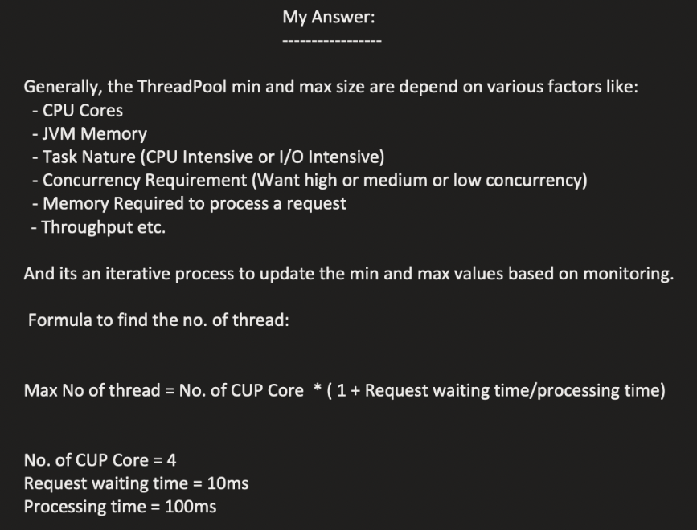
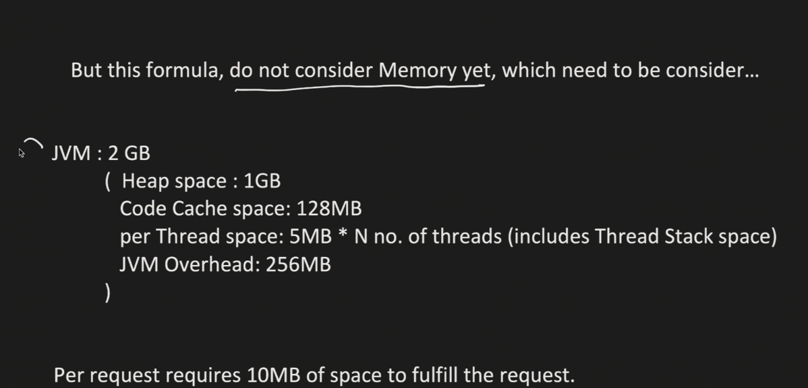

## 7. Interview Question: Determining Pool Size

<p align="center">
  
</p>

### Overview

The instructor now addresses the original interview question that motivated this entire lecture:

**Interview Question:**
> "In a thread pool, why you have taken core pool size as two? Why not 10 or 15 or another number? What is the logic?"

---

## 7.1 The Question Context

### Scenario

The instructor explains the interview situation:
> "The candidate has been asked to create a thread pool, and this core pool size is the number which we have to define in the thread pool executor."

**What happened in interview:**
```java
ThreadPoolExecutor executor = new ThreadPoolExecutor(
    2,      // ← Why 2? Why not 10 or 15?
    4,      // ← Why 4?
    10,
    TimeUnit.MINUTES,
    new ArrayBlockingQueue<>(2),
    threadFactory,
    handler
);
```

**Follow-up Question:**
> "Why four? Why two? Why not I create here 20? Why not I create here 10? What is the reasoning behind taking certain numbers?"

---

## 7.2 The Instructor's Perspective

### Important Disclaimer

The instructor clarifies:
> "So the question is what is the reasoning behind to decide what core pool size should be minimum and maximum? So again this is my theory and my answer. This is very subjective question. Lot of different engineers might have different answer."

**Key Point:** There is no single "correct" answer. Different approaches and reasoning are valid.

---

## 7.3 Factors Affecting Thread Pool Size

### Major Factors to Consider

<p align="center">
  
</p>

The instructor identifies key factors:
> "Generally the thread pool minimum and maximum size are depend upon various factors."

---

### Factor 1: CPU Cores

**Why CPU cores are important:**

The instructor recalls from the beginning:
> "Very important factor you know right. Why CPU core is important. I told you in the start that if you have only two CPU core, core one, core two, and if you create 100 threads, you know that most of the time they will spend just doing context switching."

**The Problem:**
```
CPU Cores: 2
    [Core 1] [Core 2]

Threads Created: 100
    [T1] [T2] [T3] ... [T100]

Reality: Only 2 threads can run in parallel at any time
```

**Context Switching Issue:**
```
Time Slot 1: Core 1 → Thread 1  |  Core 2 → Thread 2
             ↓ Save state, Load new threads
Time Slot 2: Core 1 → Thread 3  |  Core 2 → Thread 4
             ↓ Save state, Load new threads
Time Slot 3: Core 1 → Thread 5  |  Core 2 → Thread 6
```

**The Cost:**
> "So if you are creating more and more and more threads, it is a chance that more context switching time get increased and there would be a wastage of CPU time and CPU instead of doing processing it, just keep on doing context switching."

**Key Insight:**
- More threads than CPU cores = More context switching
- Context switching = CPU idle time
- CPU spends time switching instead of processing
- **CPU cores is a critical limiting factor**

---

### Factor 2: JVM Memory

**Why JVM memory matters:**

The instructor explains:
> "You know that everything, our program which runs in a JVM memory. JVM has different memory like heap and the thread gets certain memory like stack space. And there also get certain like a program counter and other spaces."

**Memory Allocation for Threads:**

Each thread requires:
- **Stack space** - For method calls, local variables
- **Program counter** - Tracks execution position
- **Other thread-specific memory** - Registers, etc.

**The Constraint:**
```
JVM Memory: 2 GB (Limited Resource)
    ├─ Heap
    ├─ Stack (per thread)
    ├─ Code Cache
    ├─ Program Counters
    └─ Other overhead

If JVM = 2 GB, can't create unlimited threads!
```

**Real-World Limitation:**
> "So we can't just create as much as threads as possible because JVM lets say if you have given two GB then you have a limited resource. Now even let's say your core of so many cores you can do very fast processing. Your cores are super fast, but your memory is only two GB. Then definitely you can't create 100 threads here. There is no space at all to keep it."

**Key Insight:** Even with many CPU cores, memory limits how many threads you can create.

---

### Factor 3: Task Nature (CPU-Intensive vs IO-Intensive)

<p align="center">
  
</p>

**Two Types of Tasks:**
The instructor categorizes:
> "Then you have to consider the task nature, whether it's a CPU intensive or IO intensive."

---

#### CPU-Intensive Tasks

**Definition:** Tasks that require more CPU processing time

**Characteristics:**
- Heavy computation
- Calculations, algorithms
- Data processing
- Minimal waiting time
- Thread actively uses CPU

**Examples:**
- Mathematical calculations
- Image/video processing
- Data encryption/decryption
- Complex algorithms

**Thread Pool Strategy:**
> "CPU intensive means they want more CPU time, more processing time."

**Recommendation:** **FEWER threads** for CPU-intensive tasks

**Why?**
- Each thread needs CPU time
- Too many threads = More context switching
- Better to have threads closer to CPU core count
- Less context switching = More actual processing

---

#### IO-Intensive Tasks

**Definition:** Tasks that spend time waiting for Input/Output operations

**Characteristics:**
- Database calls
- File read/write operations
- Network requests
- External API calls
- Thread is IDLE during I/O wait

**Examples:**
- Database queries
- REST API calls
- File operations
- Network communication

**Thread Pool Strategy:**

The instructor explains:
> "IO means that, let's say you want to write something into, you want to read something from the DB. There is a DB call or there is an external call, so thread is idle during the I/O call."

**Recommendation:** **MORE threads** for IO-intensive tasks

**Why?**
> "So when thread is idle, it is better to have more threads so that CPU should not wait. CPU can just do context switch. Let it wait. Which thread is waiting for input output operation by the time CPU can process some other thread."

**Flow:**
```
Thread 1: Waiting for DB response (IDLE)
    ↓
CPU: Don't waste time, switch to Thread 2
    ↓
Thread 2: Waiting for API response (IDLE)
    ↓
CPU: Switch to Thread 3
    ↓
Thread 3: Processing data (ACTIVE)
```

**Key Insight:**
- More threads for I/O tasks = Better CPU utilization
- While one thread waits, CPU can process another
- Reduces CPU idle time

---

#### Summary: CPU vs IO Tasks

| Aspect | CPU-Intensive | IO-Intensive |
|--------|---------------|--------------|
| **CPU Usage** | High | Low (mostly waiting) |
| **Thread State** | Active/Running | Waiting/Blocked |
| **Recommended Threads** | FEWER (close to CPU cores) | MORE (many more than cores) |
| **Reason** | Avoid context switching | Utilize CPU during waits |
| **Example** | Video encoding | Database queries |

**The instructor's rule:**
> "If it is CPU intensive, the number of threads should be less. If it is an IO intensive number of threads can be more."

---

### Factor 4: Concurrency Requirement

**What to consider:**

The instructor mentions:
> "Concurrency requirement that, yes, I want a high concurrency, low concurrency, medium concurrency."

**Questions to ask:**
- How many concurrent requests do you expect?
- What's your target throughput?
- How many simultaneous operations needed?

**Examples:**

**Low Concurrency:**
```
Expected concurrent users: 10-50
Thread pool size: Small (5-10 threads)
```

**Medium Concurrency:**
```
Expected concurrent users: 100-500
Thread pool size: Medium (20-50 threads)
```

**High Concurrency:**
```
Expected concurrent users: 1000+
Thread pool size: Large (50-200 threads)
```

---

### Factor 5: Memory Required Per Request

<p align="center">
  
</p>

**The Critical Question:**

The instructor introduces another important factor:
> "Memory required to process a request. Now let's say that one post request is coming if that required ten MB to process it."

**Why This Matters:**

**Scenario:**
```
One POST request processing requires: 10 MB
    ├─ Load data from database
    ├─ Load data from external service
    ├─ Process in memory
    └─ Total memory needed: 10 MB (stored in heap)
```

**The Problem:**
```
If you have: 100 threads
Each thread processes: 1 request
Each request needs: 10 MB

Total memory needed: 100 × 10 MB = 1000 MB (1 GB)

Question: Do you have 1 GB available in heap?
```

**The instructor's concern:**
> "If one request takes ten MB. Now let's say that I can have 1000 threads. If 100 threads accepted this Post request and each request takes ten MB, do you have sufficient memory here in the heap?"

**Key Constraint:** Heap memory must support all concurrent requests

---

### Factor 6: Throughput

**What is throughput?**

The instructor mentions:
> "And throughput like how fast you can process the request."

**Considerations:**
- How quickly must tasks be completed?
- What's your SLA (Service Level Agreement)?
- What response time is acceptable?

**Impact on thread pool size:**
- Higher throughput requirement = More threads needed
- But balanced against other factors (CPU, memory)

---

### Factor 7: Other Considerations

The instructor acknowledges:
> "So and there could be etc. there could be more. But these are the major you can say that factors on top of my mind, which has to be configured before we comes to this minimum and maximum size."

**Additional factors might include:**
- Network latency
- Database connection pool size
- External service rate limits
- Application architecture
- Load balancing strategy
- Peak vs average load patterns

---

## 7.4 Formula-Based Approach

### The Formula

The instructor introduces a formula for maximum thread calculation:

**Formula:**
```
Maximum Threads = Number of CPU Cores × (1 + (Wait Time / Processing Time))
```

**Components:**
- **Number of CPU Cores** - Physical/logical cores available
- **Wait Time** - Time spent waiting (I/O operations)
- **Processing Time** - Time spent in actual CPU processing

---

### Important Disclaimer

The instructor cautions:
> "But again this formula is not full proof. This doesn't even consider all the factors. This is just give you what is the maximum you can have. Or what is at least it will give you a start point, you can say that."

**What the formula considers:**
- ✓ CPU cores
- ✓ Task nature (wait time vs processing time)
- ✓ Throughput (indirectly)

**What the formula does NOT consider:**
- ✗ JVM memory constraints
- ✗ Memory per request
- ✗ Heap size limitations
- ✗ Other resource limits

---

### Understanding the Formula Components

#### Wait Time / Processing Time Ratio

**CPU-Intensive Tasks:**
```
Processing Time: 100 ms (high)
Wait Time: 2 ms (low)

Ratio: 2 / 100 = 0.02 (close to 0)
```

**IO-Intensive Tasks:**
```
Processing Time: 100 ms
Wait Time: 50 ms (high)

Ratio: 50 / 100 = 0.5
```

**Highly IO-Intensive:**
```
Processing Time: 100 ms
Wait Time: 300 ms (very high)

Ratio: 300 / 100 = 3
```

---

### Example Calculation 1: CPU-Intensive

**Given:**
```
CPU Cores: 64
Request Wait Time: 50 ms
Processing Time: 100 ms
Task Type: More CPU-intensive (processing > waiting)
```

**Calculation:**
```
Maximum Threads = 64 × (1 + (50 / 100))
                = 64 × (1 + 0.5)
                = 64 × 1.5
                = 96 threads
```

**Interpretation:**

The instructor explains:
> "So you can say that it is more CPU intensive than IO. So IO is less, CPU processing time is more."

But he notes:
> "So here, if you see that this ultimately give you around 64 only."

**Why close to 64?**
- Because it's CPU-intensive
- Wait time is relatively small
- Formula suggests threads close to core count
- Minimizes context switching

---

### Example Calculation 2: Highly CPU-Intensive

**Given:**
```
CPU Cores: 64
Wait Time: 2 ms (very low)
Processing Time: 30 ms (high)
Task Type: Highly CPU-intensive
```

**Calculation:**
```
Maximum Threads = 64 × (1 + (2 / 30))
                = 64 × (1 + 0.067)
                = 64 × 1.067
                = 68 threads (approximately 64)
```

**The instructor's insight:**
> "So I have taken an express 64. So number of CPU core which can be required is that 64. Can we can have a maximum number of this threads."

**Visual:**
```
64 CPU Cores:
[Core 1] [Core 2] [Core 3] ... [Core 64]

Recommended: ~64 threads
    ↓
Each thread maps to one core
    ↓
Minimal/No context switching
    ↓
Maximum processing efficiency
```

**Key Learning:**
> "If it is a high CPU intensive task, means it is better to have this many threads itself so that they can run parallel. There would be very less context switching or no context switching at all."

---

### Formula Limitations

**The instructor is very clear:**
> "But is this the correct solution? We have come up with the number of threads. But does it considering the memory? Know this formula. Do not even consider the memory yet."

**Critical Point:** The formula gives you a starting point based on CPU and task nature, but **DOES NOT consider memory constraints**.

---

## 7.5 Memory-Based Calculation

<p align="center">
  
</p>

### Step 2: Consider JVM Memory

Now the instructor shows how to factor in memory constraints:

**Scenario:**
```
Total JVM Memory: 2 GB (2000 MB)
```

**Memory Breakdown:**

The instructor allocates:
```
Heap Memory: 1 GB (1000 MB)
Code Cache: 128 MB
JVM Overhead: 256 MB (for JVM internal operations)
Other: Variable
```

**Calculation:**
```
Total JVM: 2000 MB
Used:
  - Heap: 1000 MB
  - Code Cache: 128 MB
  - JVM Overhead: 256 MB
  - Total Used: 1384 MB

Remaining: 2000 - 1384 = 616 MB (approximately)
```

The instructor estimates:
> "So 500 MB left. So out of this 500 MB, you know that we can now can be accommodate for thread."

**Available for Threads: ~500 MB**

---

### Memory Per Thread

**Thread Memory Requirements:**

The instructor explains what each thread needs:
> "Now for each thread you need to create a stack. You need to create a register. And there are other things which thread is stored."

**Example Allocation:**
```
Per Thread Memory:
  - Stack: 2 MB
  - Registers/Program Counter: 1 MB
  - Other structures: 2 MB
  
Total per thread: 5 MB
```

---

### Calculate Maximum Threads from Memory

**Given:**
```
Available Memory for Threads: 500 MB
Memory per Thread: 5 MB
```

**Calculation:**
```
Maximum Threads = Available Memory / Memory per Thread
                = 500 MB / 5 MB
                = 100 threads
```

**The instructor's result:**
> "So let's say one thread takes five MB and we have 500 MB left. So how many threads we can create maximum here in this space which is left is 100. Let's say 100 threads we can create."

---

### Comparing Formula vs Memory Results

**Results So Far:**
```
From CPU Formula: 64 threads (based on CPU cores and task nature)
From Memory Calculation: 100 threads (based on available memory)
```

**The instructor's observation:**
> "So now we got another part like okay. With this formula we know that 64 thread is good to go. But this doesn't even consider the memory. But here we have considered the JVM memory. JVM tells that okay, maximum 100 threads, we can create this much space."

**Question:** Are we done? Can we use 100 threads?

**Answer:** Not yet! We have one more constraint to consider...

---

## 7.6 Heap Memory and Request Processing

### The Heap Constraint

**New Factor:** Memory required to process each request

The instructor introduces the final constraint:
> "But can, is this again a good number? Like this many threads actually can work together. Now we have to consider this memory required for process to request."

---

### Request Memory Requirements

**Scenario:**
```
One request requires: 10 MB
    ├─ Load data from database
    ├─ Load data from external services
    ├─ In-memory processing
    └─ Temporary objects
    
All this data stored in: HEAP memory
```

---

### The Critical Calculation

**Given:**
```
Threads created: 100
Each thread processes: 1 request
Each request needs: 10 MB heap space
Heap size: 1000 MB (1 GB)
```

**If all 100 threads process requests simultaneously:**
```
Total Heap Needed = 100 threads × 10 MB per request
                  = 1000 MB
                  = 1 GB (FULL HEAP!)
```

**The Problem:**

The instructor identifies the issue:
> "How many space is required? 1000 MB let's say one GB so means it required full heap space. Your heap would be full. That is risky again."

**Why is this risky?**
- Heap completely full
- No space for other operations
- Risk of OutOfMemoryError
- No buffer for garbage collection
- Application might crash

---

### The Solution: Add Safety Buffer

**The instructor's approach:**
> "So we can say that we can put certain buffer and we can use let's say 60% or 70% of heap because it might we might need a heap for some other task also."

**Safe Approach:**
```
Use only 60% of heap for request processing
    ↓
Available heap for requests = 1000 MB × 0.60
                            = 600 MB
```

**Recalculate Maximum Threads:**
```
Each request needs: 10 MB
Safe heap available: 600 MB

Maximum Safe Threads = 600 MB / 10 MB
                     = 60 threads
```

**The instructor's conclusion:**
> "So let's say we can create 60 thread so 60 into ten MB 600 MB at a time. This memory can be used of a heap. It's okay. We have 1000 MB in heap. If you create 60 threads 600 MB would be used."

---

### Safety Reasoning

**Why keep 40% buffer?**
```
Total Heap: 1000 MB
    ├─ 600 MB: Request processing (60%)
    └─ 400 MB: Buffer (40%)
              ├─ Garbage collection
              ├─ Other application needs
              ├─ Temporary objects
              └─ Safety margin
```

**Benefits:**
- Prevents OutOfMemoryError
- Room for garbage collection
- Space for other operations
- System stability

---

## 7.7 Final Thread Pool Configuration

### Bringing It All Together

The instructor now combines all three calculations:

**Three Constraints:**
```
1. CPU Formula Result: 64 threads
2. Memory (Thread overhead): 100 threads  
3. Heap Memory (Request processing): 60 threads
```

---

### Determining Core and Maximum Pool Size

**The instructor's reasoning:**
> "So this number I can say that yes, it is safe to use 60% of the heap memory for the threads. So what is the maximum thread I can create is 60. Based on the memory constraint. And this formula says that okay you can maximum use 64. So that's where I can say that okay minimum I can give 60. Maximum I can give 64 or around to it let's say 70."

**Final Configuration:**
```java
ThreadPoolExecutor executor = new ThreadPoolExecutor(
    60,     // corePoolSize (based on heap constraint)
    64,     // maximumPoolSize (based on CPU formula)
    // or
    70,     // maximumPoolSize (with some buffer)
    10,
    TimeUnit.MINUTES,
    new ArrayBlockingQueue<>(size),
    threadFactory,
    handler
);
```

**Reasoning:**

1. **corePoolSize = 60**
    - Limited by heap memory and request processing
    - Most restrictive constraint
    - Safe for continuous operation

2. **maximumPoolSize = 64 (or 70)**
    - Based on CPU cores and task nature
    - Handles peak load
    - Within acceptable range

---

### Constraint Analysis

| Constraint | Result | Status |
|------------|--------|--------|
| **CPU + Task Nature** | 64 threads | OK - Not the bottleneck |
| **Thread Memory** | 100 threads | OK - Not the bottleneck |
| **Heap + Request Size** | 60 threads | **BOTTLENECK** ⚠️ |

**Most Restrictive:** Heap memory with request processing needs

**Decision:** Use the most restrictive constraint as the baseline.

---

## 7.8 Iterative Refinement

<p align="center">
  
</p>

### This is Just the Start

The instructor emphasizes:
> "And then there I can do monitoring. And there are different tools to monitor like profiling tools are there now. But what I meant to say now you have to do iterative monitoring. You have to perform load testing with this number and say that yes, this number is fine or not and optimize this number."

---

### The Complete Process

**Step 1: Calculate Initial Values**
```
Use formulas and calculations → Get starting numbers (60/64)
```

**Step 2: Implement and Deploy**
```
Create thread pool with calculated values → Deploy to production
```

**Step 3: Monitor Performance**
```
Use profiling tools:
  - CPU utilization
  - Memory usage
  - Thread states
  - Response times
  - Throughput
```

**Step 4: Analyze Metrics**
```
Identify bottlenecks:
  - Are threads idle?
  - Is CPU maxed out?
  - Memory issues?
  - Queue size problems?
```

**Step 5: Adjust and Optimize**
```
Fine-tune configuration:
  - Increase/decrease core size
  - Adjust maximum size
  - Modify queue size
  - Change rejection policy
```

**Step 6: Load Testing**
```
Simulate production load:
  - Peak load scenarios
  - Sustained load
  - Spike scenarios
  - Monitor behavior
```

**Step 7: Iterate**
```
Repeat steps 3-6 until optimal performance achieved
```

---

### Tools for Monitoring

**Profiling Tools:**
- VisualVM
- JProfiler
- YourKit
- Java Mission Control
- New Relic / AppDynamics (APM tools)

**What to Monitor:**
- Thread count and states
- CPU usage per thread
- Memory allocation
- Garbage collection
- Queue sizes
- Task completion times
- Rejection rates

---

## 7.9 Interview Answer Strategy

### How to Answer in Interview

**The instructor's approach:**

**Step 1: Acknowledge Subjectivity**
> "This is very subjective question. Lot of different engineers might have different answer."

**Step 2: List All Factors**
```
"I would consider several factors:
  1. CPU cores available
  2. JVM memory constraints
  3. Task nature (CPU vs IO intensive)
  4. Concurrency requirements
  5. Memory per request
  6. Throughput expectations
```

**Step 3: Walk Through Calculations**
```
"Let me walk through my reasoning:

For a system with:
- 64 CPU cores
- 2 GB JVM memory
- IO-bound tasks with wait time 50ms, processing time 100ms
- Each request needs 10 MB

I would calculate:
1. CPU formula: 64 × (1 + 50/100) = 96 threads
2. Thread memory: ~100 threads possible
3. Heap constraint: 60 threads safe (60% of 1GB for requests)

Most restrictive: 60 threads
```

**Step 4: Explain Choice**
```
"I would set:
- corePoolSize: 60 (based on heap constraint)
- maximumPoolSize: 70-96 (for peak handling)

This provides:
- Safe normal operation
- Room for peaks
- Efficient resource usage
```

**Step 5: Mention Iteration**
```
"However, these are initial estimates. I would:
- Deploy with these settings
- Monitor with profiling tools
- Perform load testing
- Adjust based on actual metrics
- Iterate until optimal
```

---

### Sample Interview Response

**Question:** "Why did you choose corePoolSize = 2?"

**Strong Answer:**

> "That's a great question. Thread pool sizing depends on multiple factors. In this case, I chose 2 based on [explain your context]:
>
> First, I considered our CPU cores - we have 4 cores available.
>
> Second, I analyzed the task nature - our tasks are primarily I/O bound with database calls, averaging 200ms wait time and 50ms processing time.
>
> Using the formula: threads = cores × (1 + wait/service), I get: 4 × (1 + 200/50) = 4 × 5 = 20 threads maximum.
>
> However, I also considered memory constraints. With our JVM heap of 512MB and each request requiring approximately 20MB, I can safely support around 15-20 concurrent requests (using 60% of heap).
>
> For the core size, I set it to 2 because that handles our average load of 5-10 concurrent requests efficiently. The maximum of 5 handles our peak loads.
>
> I would validate these numbers through load testing and monitoring, adjusting based on actual CPU utilization, memory usage, and response times."

---

## 7.10 Key Takeaways

### The instructor's final points:

**1. No One-Size-Fits-All Answer**
- Different applications have different needs
- Context matters immensely
- What works for one app may not work for another

**2. Multiple Factors to Consider**
```
✓ CPU cores
✓ JVM memory
✓ Task nature (CPU/IO)
✓ Concurrency needs
✓ Memory per request
✓ Throughput requirements
✓ And more...
```

**3. Formulas Give Starting Point**
- CPU formula provides baseline
- But doesn't consider everything
- Use as initial estimate only

**4. Memory is Critical**
- Often the most restrictive factor
- Must consider both thread overhead AND request processing
- Leave safety buffer (60-70% utilization)

**5. Iteration is Essential**
- Initial calculations are estimates
- Real-world monitoring is crucial
- Load testing validates assumptions
- Continuous optimization needed

**6. Document Your Reasoning**
- In interviews: explain your thought process
- In production: document why you chose specific values
- Helps future maintenance and tuning

---

### Summary Table: Decision Framework

| Factor | Impact on Thread Count | How to Measure |
|--------|----------------------|----------------|
| **CPU Cores** | More cores = More threads | Check system specs |
| **Task Type** | CPU-bound = Fewer<br>IO-bound = More | Profile application |
| **Thread Memory** | Higher memory = Fewer threads | JVM settings, profiling |
| **Request Memory** | Higher memory = Fewer threads | Monitor heap usage |
| **Concurrency** | Higher concurrency = More threads | Expected load |
| **Throughput** | Higher throughput = More threads | SLA requirements |

---

### Formula Summary

**Maximum Threads (CPU-based):**
```
Threads = CPU Cores × (1 + Wait Time / Processing Time)
```

**Maximum Threads (Memory-based):**
```
Threads = Available Memory / Memory Per Thread
```

**Safe Thread Count (Heap-based):**
```
Threads = (Heap Size × 0.6) / Memory Per Request
```

**Final Decision:**
```
corePoolSize = min(all calculated values)
maximumPoolSize = slightly higher for peak handling
```

---

## 7.11 Conclusion

The instructor concludes:
> "So I think today's session is very big and this is very important topic. It's interesting also. But these are the next I will cover again an important part. But do check out this video again. If it is not clear or ping me we can discuss more and do practice it. Also man like code it out right and practice this thread pool. Very very important."

**Final Message:**
- This is a crucial topic for both interviews and production
- Practice implementing thread pools
- Understand the concepts deeply
- Review if needed
- Very, very important for real-world applications

---

**End of Lecture Notes** 🎓

---