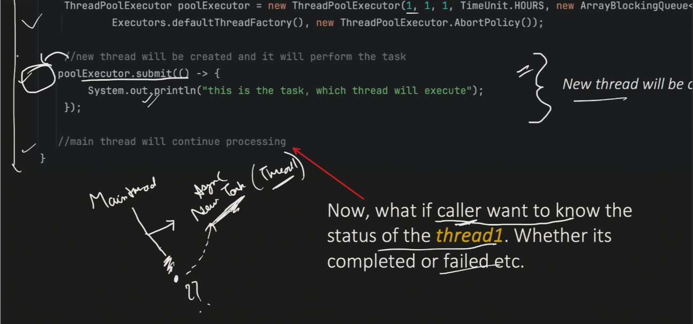

# Future Interface in Java

## 📌 Table of Contents
1. [The Problem](#the-problem)
2. [What is Future?](#what-is-future)
3. [Why Future is Needed](#why-future-is-needed)
4. [Future Methods](#future-methods)
5. [Code Examples](#code-examples)
6. [Internal Working](#internal-working)
7. [Key Takeaways](#key-takeaways)

---

## ❓ The Problem

<p align="center">
  
</p>

### Scenario Without Future
```java
ThreadPoolExecutor executor = new ThreadPoolExecutor(/*...*/);
executor.submit(() -> {
    // Async task
    System.out.println("Task executing...");
});
```

**Issues:**
- ❌ Main thread cannot track task status
- ❌ No way to know if task completed or failed
- ❌ Cannot retrieve any output from the task
- ❌ No reference to check exceptions
- ❌ Cannot cancel the task

### The Question
> **"What if the caller (main thread) wants to know the status of the thread - whether it's completed, failed, or has produced output?"**

---

## 🎯 What is Future?

**Future** is an **interface** that represents the **result of an asynchronous task**.

### Definition
```
Future = A placeholder for the result of an async computation
```

### Purpose
It allows you to:
- ✅ Check if computation is completed
- ✅ Get the result when ready
- ✅ Handle any exceptions
- ✅ Cancel the task if needed

---

## 💡 Why Future is Needed

### Thread Execution Flow
```
Main Thread                    Thread-1 (from pool)
    |                                |
    |------- submit(task) --------->|
    |                                | (executing task)
    | (continues processing)         |
    |                                |
    | Future object holds reference  |
    |                                |
    | Can check status anytime -------> (get status)
```

### Key Point
- `submit()` method returns a **Future** object
- Main thread holds this Future reference
- Using Future object, main thread can query task status

---

## 🔧 Future Methods

### 5 Important Methods

| Method | Return Type | Description |
|--------|-------------|-------------|
| `cancel(boolean)` | `boolean` | Attempts to cancel task execution |
| `isCancelled()` | `boolean` | Returns true if task was cancelled |
| `isDone()` | `boolean` | Returns true if task completed |
| `get()` | `V` | Waits indefinitely and retrieves result |
| `get(timeout, unit)` | `V` | Waits for specified time and retrieves result |

---

### 1️⃣ `cancel(boolean mayInterruptIfRunning)`

**Purpose**: Attempts to cancel the execution of the task
```java
Future<?> future = executor.submit(() -> {
    // long running task
});

boolean cancelled = future.cancel(true);
```

**Return Value:**
- `true` - Task was successfully cancelled
- `false` - Task cannot be cancelled (already completed)

**When it returns false:**
- ❌ Task is already completed
- ❌ Task cannot be interrupted

---

### 2️⃣ `isCancelled()`

**Purpose**: Checks if the task was cancelled
```java
if (future.isCancelled()) {
    System.out.println("Task was cancelled");
}
```

**Returns:**
- `true` - Task was cancelled before normal completion
- `false` - Task was not cancelled

---

### 3️⃣ `isDone()`

**Purpose**: Checks if the task is completed
```java
if (future.isDone()) {
    System.out.println("Task is done");
}
```

**Returns `true` when:**
- ✅ Task completed normally
- ✅ Task completed with exception
- ✅ Task was cancelled

**Returns `false` when:**
- ❌ Task is still in progress

---

### 4️⃣ `get()`

**Purpose**: Blocks the caller and waits for task completion indefinitely
```java
Object result = future.get(); // Blocks until task completes
```

**Behavior:**
- 🛑 **Blocks** the calling thread
- ⏳ Waits until task completes
- 📦 Retrieves the result after completion
- ⚠️ Can wait **indefinitely** (if task runs for 20 minutes, blocks for 20 minutes)

**Important:**
> Main thread will **WAIT** at this point until the async task completes!

---

### 5️⃣ `get(long timeout, TimeUnit unit)`

**Purpose**: Waits for a specified time period
```java
try {
    Object result = future.get(3, TimeUnit.SECONDS);
} catch (TimeoutException e) {
    System.out.println("Task did not complete in time");
}
```

**Behavior:**
- ⏱️ Waits only for the specified timeout period
- ⚠️ Throws `TimeoutException` if task doesn't complete in time
- ✅ Gives more control over waiting time

**Advantage:**
- Better than `get()` as it doesn't block indefinitely
- You decide the maximum wait time

---

## 💻 Code Examples

### Example 1: Basic Future Usage
```java
ThreadPoolExecutor executor = new ThreadPoolExecutor(
    1, 1, 1, TimeUnit.SECONDS, 
    new ArrayBlockingQueue<>(10)
);

// Submit task and get Future reference
Future<?> future = executor.submit(() -> {
    try {
        Thread.sleep(7000); // Simulates 7 second task
        System.out.println("Task completed by " + 
            Thread.currentThread().getName());
    } catch (InterruptedException e) {
        e.printStackTrace();
    }
});

// Main thread continues...
System.out.println("Main thread continues...");
```

**Flow:**
```
Main Thread          Thread-1
    |                   |
    |---- submit() ---->| (starts 7-second task)
    | (continues)       |
    |                   | (sleeping...)
```

---

### Example 2: Checking Task Status
```java
// Check if task is done
System.out.println("Is Done? " + future.isDone()); // false (task takes 7 seconds)

// Try to get result with timeout
try {
    future.get(2, TimeUnit.SECONDS); // Wait only 2 seconds
} catch (TimeoutException e) {
    System.out.println("Timeout Exception: Task not completed in 2 seconds");
}

// Block and wait indefinitely
future.get(); // Blocks until task completes (waits remaining ~5 seconds)

// Now check again
System.out.println("Is Done? " + future.isDone()); // true

// Check if cancelled
System.out.println("Is Cancelled? " + future.isCancelled()); // false
```

**Output Flow:**
```
Is Done? false
Timeout Exception: Task not completed in 2 seconds
(waits ~5 more seconds...)
Task completed by pool-1-thread-1
Is Done? true
Is Cancelled? false
```

---

### Example 3: Complete Flow Diagram
```
Time: 0s
Main: Is Done? → false (task needs 7s)

Time: 0s - 2s
Main: get(2, SECONDS) → TimeoutException (task still running)

Time: 2s - 7s
Main: get() → BLOCKS and WAITS
Thread-1: Executing task...

Time: 7s
Thread-1: Task completed!
Main: get() returns → unblocks

Time: 7s+
Main: Is Done? → true
Main: Is Cancelled? → false
```

---

## ⚙️ Internal Working

### How Future Works with ThreadPoolExecutor
```java
Future<?> future = executor.submit(runnableTask);
```

**What happens internally:**

1. **ThreadPoolExecutor creates FutureTask**
```java
   // Internally
   FutureTask<?> futureTask = new FutureTask<>(runnableTask);
```

2. **FutureTask wraps the Runnable**
```
   FutureTask {
       - Runnable task
       - State (NEW, RUNNING, COMPLETED, CANCELLED, etc.)
       - Result/Output
   }
```

3. **FutureTask is submitted to thread pool**
    - Thread from pool picks up the FutureTask
    - Thread updates the state as it executes
    - Thread stores result/exception in FutureTask

### Future Hierarchy
```
<<interface>> Future,  <<interface>> Runnable
                     ↑
                     | extends
                     |
        <<interface>> RunnableFuture
                     ↑
                     | implements
                     |
             FutureTask (class)
```

**Key Points:**
- `Future` is an interface
- `FutureTask` is the concrete implementation
- `FutureTask` implements `RunnableFuture` which extends `Runnable` & `Future`
- ThreadPoolExecutor wraps Runnable tasks into FutureTask internally

---

## 🎓 Key Takeaways

### ✅ What We Learned

1. **Future solves the tracking problem**
    - Allows caller to track async task status
    - Provides methods to check completion, cancellation, and retrieve results

2. **Future is returned by submit()**
```java
   Future<?> future = executor.submit(task);
```

3. **5 Important Methods**
    - `cancel()` - Cancel task
    - `isCancelled()` - Check if cancelled
    - `isDone()` - Check if completed
    - `get()` - Block and wait indefinitely
    - `get(timeout, unit)` - Block with timeout

4. **get() blocks the caller**
    - Main thread will wait for task completion
    - Use `get(timeout, unit)` for better control

5. **Internal Implementation**
    - ThreadPoolExecutor wraps tasks in `FutureTask`
    - FutureTask maintains state and result
    - Thread pool updates state as task executes

---

### ⚠️ Important Notes

> **Blocking Behavior**: `get()` blocks the calling thread - use wisely!

> **Timeout Control**: Prefer `get(timeout, unit)` over `get()` for production code

> **isDone() vs isCancelled()**: `isDone()` returns true for both normal completion and cancellation

---

### 🤔 Remaining Questions

- What about the `Future<?>` wildcard? Why `<?>`?
- Can Future return values from tasks?
- How to handle tasks that return results?

**Next Topic:** These questions are answered in **Callable Interface** →

---

## 📝 Quick Reference
```java
// Create executor
ThreadPoolExecutor executor = new ThreadPoolExecutor(/*...*/);

// Submit task - get Future
Future<?> future = executor.submit(() -> {
    // async task
});

// Check status (non-blocking)
future.isDone();      // Is task completed?
future.isCancelled(); // Is task cancelled?

// Get result (blocking)
future.get();                          // Wait indefinitely
future.get(3, TimeUnit.SECONDS);      // Wait with timeout

// Cancel task
future.cancel(true);  // Interrupt if running
```

---

*Next: [Callable Interface - Three Submit Flavors →](#)*