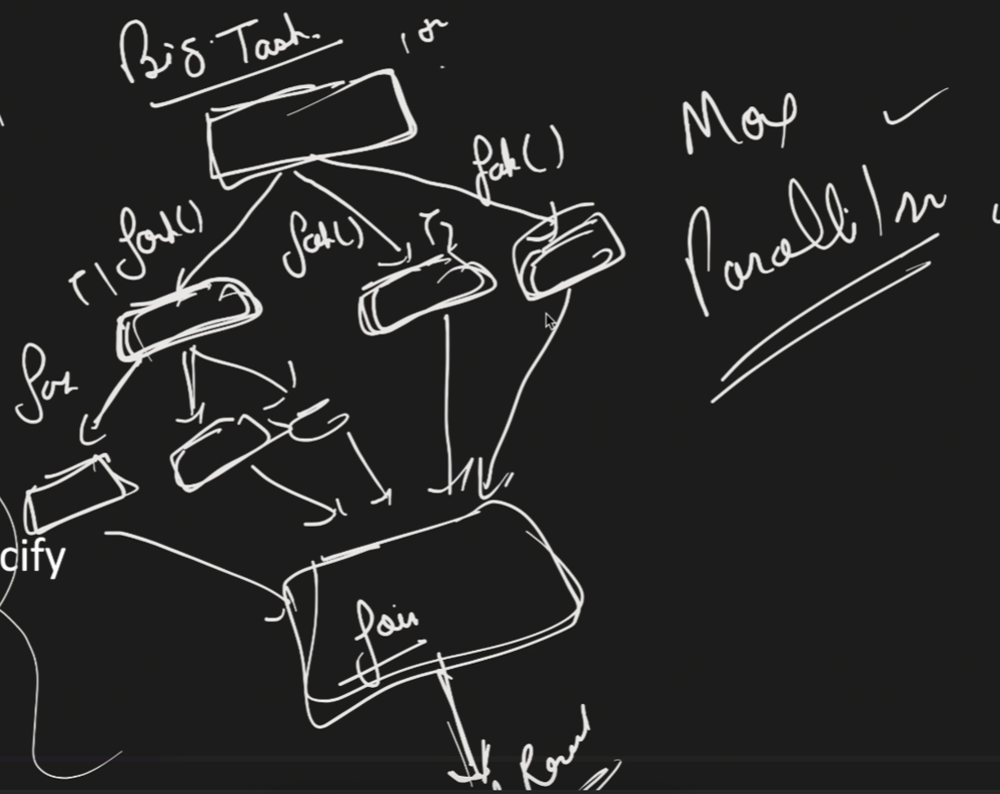
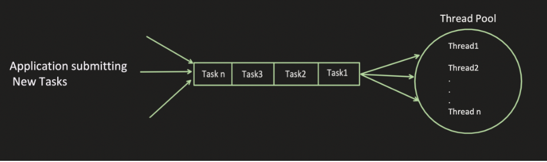
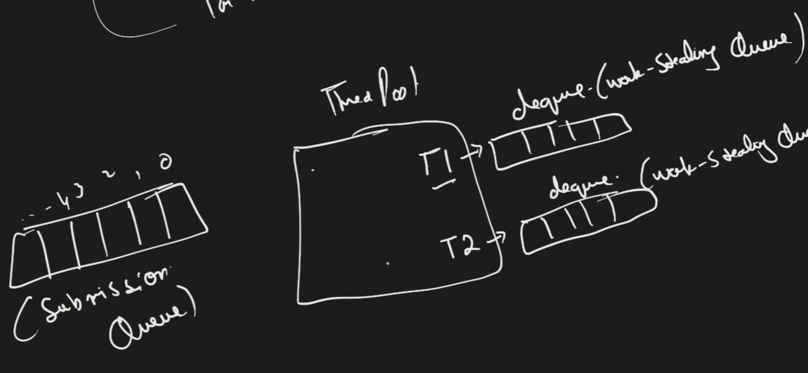
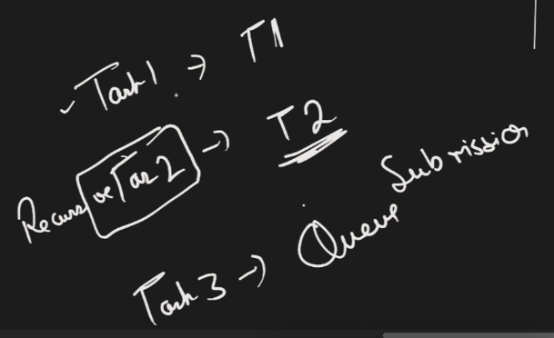
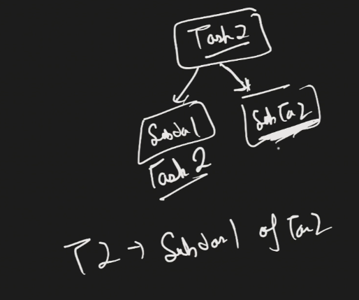
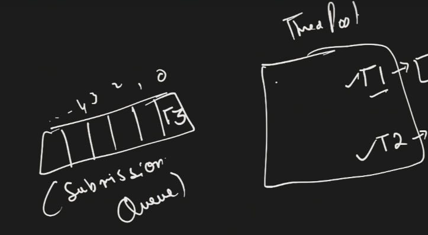
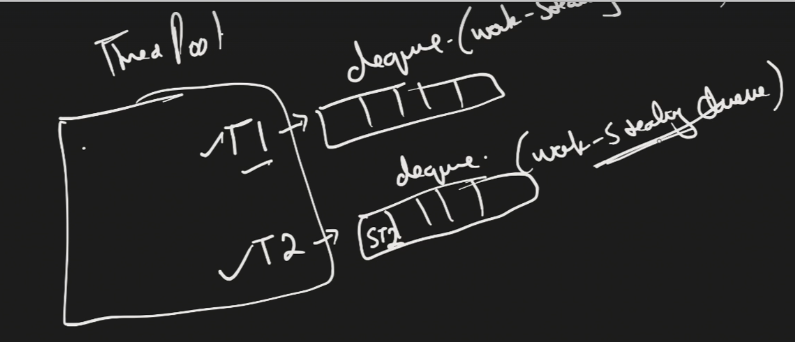

# Fork Join Pool & Work Stealing Pool Executor

## 📚 Overview

The **Work Stealing Pool Executor** and **Fork Join Pool** are advanced thread pool mechanisms designed for **parallel task execution** through a divide-and-conquer approach. They implement a **work-stealing algorithm** where idle threads can "steal" tasks from busy threads to maximize CPU utilization.

---

## What is Fork Join Pool?

### Core Concept

Fork Join Pool is designed for tasks that can be **recursively divided into smaller subtasks**. The main idea is:

1. **Fork**: Divide a big task into smaller subtasks
2. **Process**: Execute subtasks in parallel
3. **Join**: Wait for all subtasks to complete and combine results

### Purpose

- **Increase Parallelism**: Instead of one thread working on a big task, multiple threads work on smaller subtasks
- **Better CPU Utilization**: Idle threads can help busy threads by stealing their pending work
- **Divide and Conquer**: Perfect for problems that can be broken down recursively

### Visualization
<p align="center">
  
</p>

```
Big Task
    |
    |--Fork--> Subtask 1 (Thread 1 works on this)
    |
    |--Fork--> Subtask 2 (Thread 2 works on this)
    |
    |--Fork--> Subtask 3 (put in queue, can be stolen)
    |
    Join (wait for all subtasks to complete)
    |
Final Result (combined from all subtasks)
```

---

## Work Stealing Pool Executor

### Creation
```java
// Method 1: Using Executors utility class
ExecutorService executor = Executors.newWorkStealingPool();

// Method 2: Using ForkJoinPool directly
ForkJoinPool forkJoinPool = ForkJoinPool.commonPool();
```

### Key Features

- Internally creates a **Fork Join Pool**
- Implements the **work-stealing algorithm**
- Each thread maintains its own **work-stealing queue (Deque)**
- Optimized for tasks that can be divided into subtasks

---

## Traditional Thread Pool vs Work Stealing Pool

### Traditional Thread Pool Architecture
<p align="center">
  
</p>

```
Flow:
- Task 1 → Thread 1 (working)
- Task 2 → Thread 2 (working)
- Task 3 → Goes to shared queue
- When Thread 1 is free → picks Task 3 from queue
```

### Work Stealing Pool Architecture
<p align="center">
  
</p>

```
Key Differences:
1. Each thread has its OWN work-stealing queue (Deque)
2. There's ONE shared submission queue
3. Threads can "steal" tasks from other threads' queues
```

---

## Two Types of Queues

### 1. Submission Queue
- **Shared by all threads**
- Regular tasks submitted via `submit()` go here
- When threads are busy, tasks wait in this queue

### 2. Work-Stealing Queue (Deque)
- **Each thread has its own**
- Subtasks created via `fork()` go here
- Other threads can **steal** tasks from this queue
- Uses **Deque (Double-ended queue)** for efficient stealing

---

## How Work Stealing Works - Detailed Flow

### Scenario Setup
```
Thread Pool: [Thread 1] [Thread 2]
Submission Queue: []
Thread 1 Work Queue: []
Thread 2 Work Queue: []
```

### Step-by-Step Execution
<p align="center">
  
</p>

#### Step 1: Task 1 Arrives (Normal Task)
```
Task 1 (normal task) arrives
→ Thread 1 picks it up
→ Thread 1: BUSY
```

#### Step 2: Task 2 Arrives (Recursive Task - can be divided)
<p align="center">
  
</p>

```
Task 2 (recursive task) arrives
→ Thread 2 picks it up
→ Thread 2: BUSY

Task 2 can be divided into:
- Subtask 2.1
- Subtask 2.2
```

#### Step 3: Task 3 Arrives (Normal Task)
<p align="center">
  
</p>

```
Task 3 arrives
→ Both threads busy
→ Goes to Submission Queue

Submission Queue: [Task 3]
```

#### Step 4: Thread 2 Forks Task 2
<p align="center">
  
</p>

```
Thread 2 divides Task 2:
→ Subtask 2.1: Thread 2 starts working on it
→ Subtask 2.2: Goes to Thread 2's Work-Stealing Queue

Thread 2 Work Queue: [Subtask 2.2]
Thread 2: Working on Subtask 2.1
```

#### Step 5: Thread 1 Completes Task 1
```
Thread 1 completes Task 1
→ Thread 1 is now FREE

Thread 1 checks in priority order:
1. ✓ Check my own Work-Stealing Queue
   → Empty ❌
   
2. ✓ Check Submission Queue
   → Task 3 is there ✅
   → Thread 1 picks Task 3
   
Thread 1: Now working on Task 3
Submission Queue: [] (empty)
```

#### Step 6: Thread 1 Completes Task 3
```
Thread 1 completes Task 3
→ Thread 1 is FREE again

Thread 1 checks in priority order:
1. ✓ My Work-Stealing Queue → Empty ❌
2. ✓ Submission Queue → Empty ❌
3. ✓ Can I steal from other BUSY threads?
   → Thread 2 has [Subtask 2.2] in its queue ✅
   → Thread 1 STEALS Subtask 2.2

Thread 1: Now working on Subtask 2.2 (stolen from Thread 2)
Thread 2 Work Queue: [] (empty)
```

---

## Thread Priority for Task Selection

When a thread becomes free, it follows this **priority order**:
```
Priority 1: Check own Work-Stealing Queue
    ↓ (if empty)
Priority 2: Check Submission Queue
    ↓ (if empty)
Priority 3: Steal from other "busy" thread's Work-Stealing Queue
```

### Why This Priority?

1. **Own queue first**: Most efficient, no contention
2. **Submission queue second**: Shared but designed for it
3. **Steal last**: Requires coordination, but prevents idle time

---

## Deque (Double-Ended Queue) Usage

### Why Deque?

Work-stealing queues use **Deque** (Double-ended queue) for optimization:
```
Work-Stealing Queue (Deque):
Front ← [Subtask 1] [Subtask 2] [Subtask 3] → Back

Owning Thread:
→ Removes tasks from FRONT

Other Threads (stealing):
→ Steal tasks from BACK
```

### Benefits

- **Reduces Contention**: Owner and stealer work from opposite ends
- **Cache Friendly**: Owner works on most recent tasks (better cache locality)
- **Efficient Stealing**: Stealer gets oldest tasks (already cold in cache anyway)

---

## Dividing Tasks into Subtasks

### RecursiveTask vs RecursiveAction

To create tasks that can be divided, extend one of these classes:

| Class | Return Type | Use When |
|-------|-------------|----------|
| **RecursiveTask<V>** | Returns a value (generic type V) | Subtasks need to return results |
| **RecursiveAction** | void (no return) | Subtasks don't return anything |

### RecursiveTask Hierarchy
```
ForkJoinTask (abstract)
    ↓
RecursiveTask<V> (abstract)
    ↓
YourCustomTask (concrete implementation)
```

---

## Implementing a Recursive Task - Example

### Problem: Sum of Numbers from 1 to 100

Let's create a task that computes the sum of numbers in a range and divides it into subtasks.

### Code Implementation
```java
import java.util.concurrent.RecursiveTask;

public class ComputeSumTask extends RecursiveTask<Integer> {
    
    private int start;
    private int end;
    private static final int THRESHOLD = 4; // Don't divide if 4 or fewer elements
    
    // Constructor
    public ComputeSumTask(int start, int end) {
        this.start = start;
        this.end = end;
    }
    
    @Override
    protected Integer compute() {
        // Base case: if small enough, compute directly
        if (end - start <= THRESHOLD) {
            int sum = 0;
            for (int i = start; i <= end; i++) {
                sum += i;
            }
            return sum;
        }
        
        // Recursive case: divide the task
        int mid = (start + end) / 2;
        
        // Create two subtasks
        ComputeSumTask leftTask = new ComputeSumTask(start, mid);
        ComputeSumTask rightTask = new ComputeSumTask(mid + 1, end);
        
        // Fork: schedule left task for parallel execution
        leftTask.fork();  // Goes to work-stealing queue
        
        // Compute right task in current thread
        int rightResult = rightTask.compute();
        
        // Join: wait for left task to complete
        int leftResult = leftTask.join();
        
        // Combine results
        return leftResult + rightResult;
    }
}
```

### Usage
```java
import java.util.concurrent.ForkJoinPool;

public class Main {
    public static void main(String[] args) {
        // Create Fork Join Pool
        ForkJoinPool pool = ForkJoinPool.commonPool();
        
        // Create the main task
        Future<Integer> futureObj =  pool.submit(new ComputeSumTask(0, 100));

        try {
            int result = futureObj.get();
            System.out.println(result); // Output: 5050
        } catch (Exception e) {
            // exception handling
        } 
    }
}
```

---

## Understanding Fork, Compute, and Join

### Fork
```java
leftTask.fork();
```

**What happens:**
- Schedules the task for **parallel execution**
- The task goes into the **current thread's work-stealing queue**
- Other threads can steal this task if they're idle
- Does NOT block - returns immediately

### Compute
```java
int rightResult = rightTask.compute();
```

**What happens:**
- Executes the task in the **current thread**
- If the task divides further, the same process repeats
- Synchronous execution

### Join
```java
int leftResult = leftTask.join();
```

**What happens:**
- **Waits** for the forked task to complete
- Blocks until the result is available
- Returns the result computed by the forked task

---

## Task Division Example - Visual Flow

### Initial Task: Sum(1, 8)
```
Sum(1, 8) - Thread 1
    |
    ├── Fork → Sum(1, 4) [put in Thread 1's work queue]
    |          ├── Fork → Sum(1, 2)
    |          |          ├── Fork → Sum(1, 1) = 1
    |          |          └── Compute → Sum(2, 2) = 2
    |          |          Join = 3
    |          |
    |          └── Compute → Sum(3, 4)
    |                     ├── Fork → Sum(3, 3) = 3
    |                     └── Compute → Sum(4, 4) = 4
    |                     Join = 7
    |          Join = 10
    |
    └── Compute → Sum(5, 8) [Thread 1 works on this]
               ├── Fork → Sum(5, 6)
               |          ├── Fork → Sum(5, 5) = 5
               |          └── Compute → Sum(6, 6) = 6
               |          Join = 11
               |
               └── Compute → Sum(7, 8)
                          ├── Fork → Sum(7, 7) = 7
                          └── Compute → Sum(8, 8) = 8
                          Join = 15
               Join = 26

Final Join: 10 + 26 = 36
```

### Key Points

1. **Threshold Check**: `if (end - start <= 4)` - prevents infinite division
2. **One Fork, One Compute**: Efficient pattern - current thread doesn't sit idle
3. **Join Waits**: Ensures all subtasks complete before combining results

---

## Thread Count Configuration

### Method 1: Default (Based on Processors)
```java
// Uses Runtime.getRuntime().availableProcessors()
ExecutorService executor = Executors.newWorkStealingPool();

// If you have 4 cores → creates 4 threads
// If you have 8 cores → creates 8 threads
// If you have 16 cores → creates 16 threads
```

### Method 2: Specify Thread Count
```java
// Creates exactly 8 threads
ExecutorService executor = Executors.newWorkStealingPool(8);

// Min and Max pool size: both are 8
// Threads remain active (not terminated when idle)
```

---

## Where Tasks Go: Submit vs Fork

### Submit (goes to Submission Queue)
```java
pool.submit(task);
// → Goes to Submission Queue
// → Any free thread can pick it up
```

### Fork (goes to Work-Stealing Queue)
```java
task.fork();
// → Goes to current thread's Work-Stealing Queue
// → Owner thread processes from front
// → Other threads can steal from back
```

---

## RecursiveAction Example (No Return Value)
```java
import java.util.concurrent.RecursiveAction;

public class PrintTask extends RecursiveAction {
    
    private int start;
    private int end;
    private static final int THRESHOLD = 3;
    
    public PrintTask(int start, int end) {
        this.start = start;
        this.end = end;
    }
    
    @Override
    protected void compute() {
        if (end - start <= THRESHOLD) {
            // Base case: print directly
            for (int i = start; i <= end; i++) {
                System.out.println("Number: " + i);
            }
        } else {
            // Recursive case: divide
            int mid = (start + end) / 2;
            
            PrintTask leftTask = new PrintTask(start, mid);
            PrintTask rightTask = new PrintTask(mid + 1, end);
            
            // Fork both tasks
            leftTask.fork();
            rightTask.fork();
            
            // Wait for both to complete (no return value)
            leftTask.join();
            rightTask.join();
        }
    }
}
```

**Usage:**
```java
ForkJoinPool pool = new ForkJoinPool();
PrintTask task = new PrintTask(1, 10);
pool.invoke(task); // Prints numbers 1 to 10 in parallel
```

---

## Key Differences Summary

| Aspect | Submit | Fork |
|--------|--------|------|
| **Goes to** | Submission Queue | Work-Stealing Queue |
| **Used for** | External tasks | Internal subtasks |
| **Can be stolen from** | No (single shared queue) | Yes (from back of deque) |
| **Typical usage** | Entry point tasks | Divide-and-conquer subtasks |

---

## Complete Working Example with ForkJoinPool
```java
import java.util.concurrent.ForkJoinPool;
import java.util.concurrent.RecursiveTask;

// Task Definition
class SumTask extends RecursiveTask<Long> {
    private final long start;
    private final long end;
    private static final long THRESHOLD = 10_000;
    
    public SumTask(long start, long end) {
        this.start = start;
        this.end = end;
    }
    
    @Override
    protected Long compute() {
        long length = end - start;
        
        if (length <= THRESHOLD) {
            // Base case: compute directly
            long sum = 0;
            for (long i = start; i <= end; i++) {
                sum += i;
            }
            return sum;
        } else {
            // Recursive case: divide
            long mid = (start + end) / 2;
            
            SumTask leftTask = new SumTask(start, mid);
            SumTask rightTask = new SumTask(mid + 1, end);
            
            leftTask.fork();  // Async execution
            long rightResult = rightTask.compute();  // Sync in current thread
            long leftResult = leftTask.join();  // Wait for forked task
            
            return leftResult + rightResult;
        }
    }
}

// Main Class
public class ForkJoinExample {
    public static void main(String[] args) {
        
        // Method 1: Using common pool
        ForkJoinPool commonPool = ForkJoinPool.commonPool();
        SumTask task1 = new SumTask(1, 1_000_000);
        long result1 = commonPool.invoke(task1);
        System.out.println("Result: " + result1);
        
        // Method 2: Creating custom pool
        ForkJoinPool customPool = new ForkJoinPool(4);
        SumTask task2 = new SumTask(1, 1_000_000);
        long result2 = customPool.invoke(task2);
        System.out.println("Result: " + result2);
        
        customPool.shutdown();
    }
}
```

---

## When to Use Fork Join Pool

### ✅ Good Use Cases

- **Recursive algorithms**: Merge sort, quick sort, tree traversal
- **Divide and conquer problems**: Problems that can be split into independent subtasks
- **CPU-intensive tasks**: Calculations, data processing, image processing
- **Large data processing**: When you can divide data into chunks

### ❌ Not Suitable For

- **I/O-bound tasks**: File reading, network calls (use regular thread pool)
- **Tasks that can't be divided**: Sequential operations
- **Small tasks**: Overhead of forking may exceed benefits
- **Tasks with dependencies**: When subtasks depend on each other's results in complex ways

---

## Performance Considerations

### Threshold Selection
```java
private static final int THRESHOLD = 10;
```

- **Too small**: Too much overhead from task creation
- **Too large**: Not enough parallelism
- **Rule of thumb**: Should take 100-10,000 basic operations to execute

### Thread Count
```java
// Good: Matches CPU cores
Executors.newWorkStealingPool(); // Uses available processors

// May not help: More threads than cores
Executors.newWorkStealingPool(100); // On 8-core machine
```

---

## Common Patterns

### Pattern 1: Fork Both, Join Both
```java
leftTask.fork();
rightTask.fork();
long left = leftTask.join();
long right = rightTask.join();
return left + right;
```

**Use when**: Both tasks are equally expensive

### Pattern 2: Fork One, Compute Other (Recommended)
```java
leftTask.fork();
long right = rightTask.compute();
long left = leftTask.join();
return left + right;
```

**Use when**: Better utilization - current thread doesn't wait idle

### Pattern 3: Sequential Split Then Parallel
```java
List<SubTask> tasks = divideIntoTasks();
tasks.forEach(task -> task.fork());
long result = tasks.stream()
                   .mapToLong(SubTask::join)
                   .sum();
```

**Use when**: Many subtasks of unknown size

---

## Advantages of Work Stealing

1. **Better Load Balancing**: Idle threads help busy threads
2. **Improved Throughput**: Less idle time across threads
3. **Scalability**: Automatically utilizes available cores
4. **Reduced Contention**: Each thread has its own queue

## Disadvantages

1. **Complexity**: Harder to understand and debug
2. **Overhead**: Task creation and management overhead
3. **Not for all problems**: Only suitable for divide-and-conquer
4. **Memory usage**: Each thread maintains its own queue

---

## Key Takeaways

1. **Fork Join Pool** is designed for recursive, divide-and-conquer problems
2. **Work Stealing** allows idle threads to help busy threads
3. **Two queue types**: Submission Queue (shared) and Work-Stealing Queue (per-thread)
4. **RecursiveTask** returns values, **RecursiveAction** doesn't
5. **Fork** schedules async, **Join** waits for completion
6. **Deque** enables efficient stealing from the back while owner works from front
7. **Thread priority**: Own queue → Submission queue → Steal from others

---

## Additional Resources

- Practice implementing recursive algorithms (merge sort, binary tree operations)
- Experiment with different threshold values
- Monitor thread utilization using profiling tools
- Compare performance with regular thread pools for your specific use case

---

**Happy Parallel Programming! 🚀**