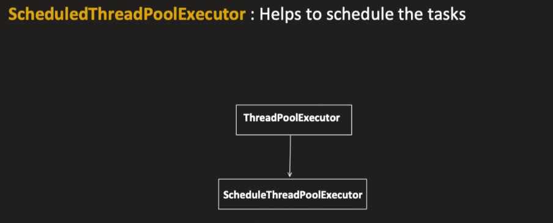

# Java ScheduledThreadPoolExecutor || Shutdown Vs AwaitTermination

## Lecture Overview


**Topic:** Java ScheduledThreadPoolExecutor, Shutdown Vs AwaitTermination  
**Duration:** ~24 minutes

---

## Topics Covered in This Lecture

1. **Shutdown vs AwaitTermination vs ShutdownNow**
2. **ScheduledThreadPoolExecutor**
3. **Virtual Thread vs Normal Thread** *(Next video)*
4. **Additional Interview Topics** *(Next video)*

**Note:** These topics were recently asked in Java interviews.

---

## Topic 1: Shutdown vs AwaitTermination vs ShutdownNow

### 1.1 shutdown()

**Purpose:** Initiates an orderly shutdown of the ExecutorService

**Behavior:**
1. **No new task submissions:** After calling `shutdown()`, the executor will not accept any new task submissions
2. **Existing tasks continue:** Already submitted tasks will continue to execute without interruption

**Key Points:**
- Does not impact already submitted tasks
- Threads that have picked tasks will continue working properly
- Main thread does not wait and continues to next line

**Example:**
```java
    ExecutorService executor = Executors.newFixedThreadPool(5);
    
    // Submit a task
    executor.submit(() -> {
        Thread.sleep(5000);
        System.out.println("Task completed");
    });
    
    // Shutdown the executor
    executor.shutdown();
    
    // This will throw RejectedExecutionException
    executor.submit(() -> System.out.println("This won't run"));
    
    System.out.println("Main thread finished");
    // Output: Main thread finishes first, but submitted task continues running
    // After 5 seconds: "Task completed" will print
```

**What happens:**
- Executor stops accepting new tasks
- If you try to submit after shutdown → `RejectedExecutionException`
- Already running threads complete their work
- Main thread doesn't wait for task completion

---

### 1.2 awaitTermination()

**Purpose:** Optional functionality to check if ExecutorService has been shut down or not

**Signature:**
```java
boolean awaitTermination(long timeout, TimeUnit unit) throws InterruptedException
```

**Behavior:**
- Returns `true` or `false`
- Does NOT force thread pool to stop
- Just a checking mechanism
- **Used after calling `shutdown()` method**

**Key Characteristics:**
1. **Blocks the calling thread** for a specific timeout period
2. **Waits** for ExecutorService shutdown
3. **Returns `true`** if ExecutorService shuts down within specified timeout
4. **Returns `false`** if timeout expires before shutdown completes

**Example:**
```java
    ExecutorService pool = Executors.newFixedThreadPool(5);
    
    pool.submit(() -> {
        Thread.sleep(5000);
        System.out.println("Task completed");
    });
    
    pool.shutdown();
    
    // Main thread will wait here for 2 seconds
    boolean isTerminated = pool.awaitTermination(2, TimeUnit.SECONDS);
    
    System.out.println("Is terminated: " + isTerminated); // false (task needs 5 sec, we waited only 2)
    System.out.println("Main thread completed");
    
    // After 5 seconds: "Task completed" prints
```

**Execution Flow:**
1. Task submitted (needs 5 seconds to complete)
2. `shutdown()` called
3. Main thread blocks at `awaitTermination(2, SECONDS)`
4. After 2 seconds, checks if pool is shut down → NO (task still running)
5. Returns `false`
6. Main thread unblocks and continues
7. After 5 seconds total, task completes

**Important Notes:**
- It's an **optional functionality**
- Doesn't force shutdown
- Doesn't do anything except provide information
- Use when you need to perform certain tasks AFTER thread pool shuts down
- If called before `shutdown()`, it's mostly of no use

---

### 1.3 shutdownNow()

**Purpose:** Best effort attempt to stop or interrupt actively executing tasks immediately

**Behavior:**
1. **Interrupts actively executing tasks**
2. **Halts processing** of tasks waiting in queue
3. **Returns a list** of tasks that were awaiting execution

**Key Points:**
- Attempts to shut down thread pool as soon as possible
- Interrupts threads even if they're sleeping or waiting
- Tasks in waiting queue are not processed
- It's a "best effort" - may not always succeed

**Example:**
```java
ExecutorService executor = Executors.newFixedThreadPool(5);

executor.submit(() -> {
    Thread.sleep(15000); // Long sleep
    System.out.println("Task completed");
});

// Instead of shutdown(), using shutdownNow()
executor.shutdownNow();

System.out.println("Main completed");
```

**What happens:**
- Task starts sleeping for 15 seconds
- `shutdownNow()` interrupts the sleeping thread
- Thread doesn't wait 15 seconds
- Task gets interrupted and completes immediately (or throws InterruptedException)

**Use Cases:**
- When you need immediate shutdown
- When waiting tasks in queue should be cancelled
- Emergency shutdown scenarios

**Comparison:**

| Method | New Tasks | Running Tasks | Waiting Tasks | Blocks Caller | Returns |
|--------|-----------|---------------|---------------|---------------|---------|
| `shutdown()` | ❌ Rejected | ✅ Continue | ✅ Will execute | ❌ No | void |
| `awaitTermination()` | N/A | N/A | N/A | ✅ Yes (timeout) | boolean |
| `shutdownNow()` | ❌ Rejected | ⚠️ Interrupted | ❌ Cancelled | ❌ No | List<Runnable> |

---

## Topic 2: ScheduledThreadPoolExecutor

<p align="center">
  
</p>


### 2.1 Introduction

**What is it?**
- A child class of `ThreadPoolExecutor`
- Specialized for scheduling tasks
- Has all methods of `ThreadPoolExecutor` (submit, execute, etc.)
- **Plus 4 additional scheduling methods**

**Creation:**
```java
ScheduledExecutorService scheduler = Executors.newScheduledThreadPool(5);
```

**Parameters:**
- `corePoolSize` (minimum threads): 5
- `maximumPoolSize`: Integer.MAX_VALUE (creates as needed)
- `keepAliveTime`: 0 nanoseconds (threads always wait, never removed even if idle)

---

### 2.2 Scheduling Methods

#### Method 1: schedule(Runnable, delay, unit)

**Purpose:** Schedule a runnable task to run ONCE after a specific delay

**Signature:**
```java
ScheduledFuture<?> schedule(Runnable command, long delay, TimeUnit unit)
```

**Example:**
```java
ScheduledExecutorService scheduler = Executors.newScheduledThreadPool(5);

scheduler.schedule(() -> {
    System.out.println("Hello");
}, 5, TimeUnit.SECONDS);

// Waits 5 seconds, then prints "Hello" ONCE
```

**Characteristics:**
- Runs only **ONE time**
- Executes after specified delay
- No return value (Runnable)

---

#### Method 2: schedule(Callable, delay, unit)

**Purpose:** Schedule a callable task to run ONCE after a specific delay, with return value

**Signature:**
```java
<V> ScheduledFuture<V> schedule(Callable<V> callable, long delay, TimeUnit unit)
```

**Example:**
```java
ScheduledExecutorService scheduler = Executors.newScheduledThreadPool(5);

ScheduledFuture<String> future = scheduler.schedule(() -> {
    return "Hello";
}, 5, TimeUnit.SECONDS);

try {
    System.out.println(future.get()); // Prints "Hello" after 5 seconds
} catch (InterruptedException | ExecutionException e) {
    e.printStackTrace();
}
```

**Characteristics:**
- Runs only **ONE time**
- Returns a value (Callable)
- Can retrieve result using `future.get()`

**Difference from Method 1:**
- Runnable: No return value
- Callable: Returns a value

---

#### Method 3: scheduleAtFixedRate(Runnable, initialDelay, period, unit)

**Purpose:** Schedule a task for **repeated execution** with a fixed rate

**Signature:**
```java
ScheduledFuture<?> scheduleAtFixedRate(Runnable command, long initialDelay, long period, TimeUnit unit)
```

**Parameters:**
- `initialDelay`: Time to wait before first execution
- `period`: Time between the START of consecutive executions

**Example:**
```java
ScheduledExecutorService scheduler = Executors.newScheduledThreadPool(5);

ScheduledFuture<?> future = scheduler.scheduleAtFixedRate(() -> {
    System.out.println("Hello");
}, 3, 5, TimeUnit.SECONDS);

// Wait 10 seconds then cancel
Thread.sleep(10000);
future.cancel(true);
```

**Execution Timeline:**
- At 3 seconds → First "Hello"
- At 8 seconds → Second "Hello" (3 + 5)
- At 13 seconds → Third "Hello" (8 + 5)
- Continues every 5 seconds until cancelled

**Characteristics:**
- Runs repeatedly
- Period starts from the **beginning** of previous execution
- If task takes longer than period, next execution waits for previous to complete
- Must be cancelled manually, otherwise runs indefinitely

**Important Behavior:**
```java
scheduler.scheduleAtFixedRate(() -> {
    System.out.println("Thread picked task");
    Thread.sleep(6000); // Task takes 6 seconds
    System.out.println("Thread completed task");
}, 1, 3, TimeUnit.SECONDS);
```

**What happens:**
- At 1 second: First task starts (prints "Thread picked task")
- Task needs 6 seconds to complete
- At 4 seconds (1 + 3): Second task is scheduled but WAITS (previous not done)
- At 7 seconds: First task completes
- Immediately: Second task starts (no gap, because it was already scheduled at 4 seconds)

**Key Point:** Next task cannot start until previous task completes, even if scheduled time has passed

---

#### Method 4: scheduleWithFixedDelay(Runnable, initialDelay, delay, unit)

**Purpose:** Schedule a task for repeated execution with a fixed delay BETWEEN executions

**Signature:**
```java
ScheduledFuture<?> scheduleWithFixedDelay(Runnable command, long initialDelay, long delay, TimeUnit unit)
```

**Parameters:**
- `initialDelay`: Time to wait before first execution
- `delay`: Time between END of one execution and START of next

**Example:**
```java
ScheduledExecutorService scheduler = Executors.newScheduledThreadPool(5);

scheduler.scheduleWithFixedDelay(() -> {
    System.out.println("Thread picked task");
    Thread.sleep(6000);
    System.out.println("Thread completed task");
}, 1, 3, TimeUnit.SECONDS);
```

**Execution Timeline:**
- At 1 second: Task starts
- Task runs for 6 seconds
- At 7 seconds: Task completes
- **Now waits 3 seconds (delay)**
- At 10 seconds: Next task starts

**Difference from scheduleAtFixedRate:**

| Method | Delay Starts From |
|--------|-------------------|
| `scheduleAtFixedRate` | Start of previous execution |
| `scheduleWithFixedDelay` | End of previous execution |

**Visual Comparison:**

**scheduleAtFixedRate:**
```
Time: 0s  1s  2s  3s  4s  5s  6s  7s  8s  9s  10s
      |---Task1(6s)---|        |-Task2-|
      ^               ^        ^
     Start          End    Task2 starts immediately
                            (was scheduled at 4s)
```

**scheduleWithFixedDelay:**
```
Time: 0s  1s  2s  3s  4s  5s  6s  7s  8s  9s  10s
      |---Task1(6s)---|   [3s delay]   |-Task2-|
      ^               ^                 ^
     Start          End              Task2 starts
                                     after 3s delay
```

---

## Summary

### Shutdown Methods

1. **shutdown()**: Graceful shutdown, no new tasks, existing tasks complete
2. **awaitTermination()**: Check if shutdown complete (blocking check)
3. **shutdownNow()**: Immediate shutdown attempt, interrupt running tasks

### ScheduledThreadPoolExecutor Methods

1. **schedule(Runnable)**: Run once after delay
2. **schedule(Callable)**: Run once after delay, return value
3. **scheduleAtFixedRate()**: Repeated execution, fixed rate (from start)
4. **scheduleWithFixedDelay()**: Repeated execution, fixed delay (from end)

---

## Next Video Topics

- Virtual Thread vs Normal Thread
- Additional Interview Questions

---

**End of Notes**