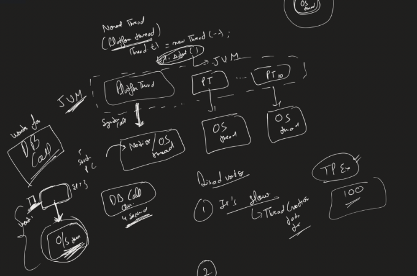

# Java ThreadLocal and Virtual Threads vs Platform Threads

## Lecture Overview

---

## Topics Covered in This Lecture

1. **ThreadLocal**
    - What is ThreadLocal
    - How ThreadLocal works internally
    - Setting and getting values
    - Cleaning up ThreadLocal (remove method)

2. **Virtual Thread vs Platform (Normal) Thread**
    - Platform Thread architecture
    - Disadvantages of Platform Threads
    - Virtual Thread architecture
    - Benefits of Virtual Threads
    - How to create Virtual Threads

**Note:** These topics were recently asked in Java interviews.

---

## Topic 1: ThreadLocal

### 1.1 What is ThreadLocal?

**Definition:** ThreadLocal is a class where each thread has its own copy of a variable

**Key Concepts:**
- Each thread has a `ThreadLocal` class object
- Inside this class, there is a ThreadLocal variable
- Each thread can store certain data in its own ThreadLocal variable
- ThreadLocal variable can hold: String, Integer, or any Object (generic type)

**Important Points:**
- Each thread has its own copy of ThreadLocal variable
- Only ONE object of ThreadLocal class is needed
- Each thread can use this single object to set and get its own thread-specific variable

---

### 1.2 Creating and Using ThreadLocal

**Creation:**
```java
ThreadLocal<String> threadLocal = new ThreadLocal<>();
```

**Setting Value:**
```java
threadLocal.set(Thread.currentThread().getName());
```

**Getting Value:**
```java
String value = threadLocal.get();
```

---

### 1.3 How ThreadLocal Works Internally

**When you call `threadLocal.set(value)`:**

1. Internally, it first gets the **current thread**
```java
   Thread currentThread = Thread.currentThread(); // e.g., main thread
```

2. Inside this current thread, it fetches the ThreadLocal class
    - Each thread maintains a ThreadLocal class internally

3. It then sets the value into that thread's ThreadLocal variable

**Key Point:** You don't have to specify which thread to set the value for - it automatically finds the current thread and updates its ThreadLocal variable

---

### 1.4 Example: Multiple Threads Using Same ThreadLocal Object
```java
// Create ONE ThreadLocal object
ThreadLocal<String> threadLocal = new ThreadLocal<>();

// Main thread sets its value
threadLocal.set(Thread.currentThread().getName()); // Sets "main"

// Create a new thread
Thread thread1 = new Thread(() -> {
    // Thread1 sets its own value
    threadLocal.set(Thread.currentThread().getName()); // Sets thread1's name
    
    // Thread1 gets its own value
    System.out.println(threadLocal.get()); // Prints thread1's name
});

thread1.start();

// Main thread gets its value
System.out.println(threadLocal.get()); // Prints "main"
```

**How it works:**
- Same `threadLocal` object is used by both threads
- When Thread1 does `threadLocal.set()`:
    - It finds current thread = Thread1
    - Fetches Thread1's ThreadLocal variable
    - Sets the value there
- When Main thread does `threadLocal.get()`:
    - It finds current thread = Main
    - Fetches Main's ThreadLocal variable
    - Gets the value from there

---

### 1.5 Cleaning Up ThreadLocal - The `remove()` Method

**Why Cleanup is Important:**

When threads are reused (like in ThreadPoolExecutor), ThreadLocal variables can persist

**Scenario:**
```
ThreadPool: [Thread1, Thread2]
Tasks: [Task1, Task2, Task3, Task4, Task5]
```

**Problem:**
1. Thread1 picks Task1
2. Task1 sets ThreadLocal variable (related to Task1)
3. Task1 completes
4. Thread1 goes back to pool
5. Thread1 picks Task4
6. **ThreadLocal variable still has Task1's data!** ❌

**Why?**
- ThreadLocal is set to the **thread**, not the task
- When thread is reused, old ThreadLocal value remains

---

### 1.6 Example: ThreadLocal Without Cleanup
```java
ThreadLocal<String> threadLocal = new ThreadLocal<>();
ExecutorService pool = Executors.newFixedThreadPool(5); // 5 threads

// Submit first task - sets ThreadLocal
pool.submit(() -> {
    threadLocal.set(Thread.currentThread().getName());
    System.out.println("Set: " + threadLocal.get());
});

// Submit 15 more tasks - just get values
for (int i = 0; i < 15; i++) {
    pool.submit(() -> {
        System.out.println("Get: " + threadLocal.get());
    });
}
```

**Output:**
- Out of 15 tasks, 3-4 tasks show ThreadLocal is already set (not null)
- **Why?** Those tasks were picked by threads that executed the first task
- ThreadLocal wasn't cleaned up, so old value persists

---

### 1.7 Solution: Using `remove()`
```java
ThreadLocal<String> threadLocal = new ThreadLocal<>();
ExecutorService pool = Executors.newFixedThreadPool(5);

// First task - sets and then removes
pool.submit(() -> {
    threadLocal.set(Thread.currentThread().getName());
    System.out.println("Set: " + threadLocal.get());
    threadLocal.remove(); // CLEANUP
});

// Submit 15 more tasks
for (int i = 0; i < 15; i++) {
    pool.submit(() -> {
        System.out.println("Get: " + threadLocal.get()); // All will be null
    });
}
```

**Output:**
- All 15 tasks show `null`
- ThreadLocal was properly cleaned up

**Best Practice:**
```java
try {
    threadLocal.set(value);
    // Do work
} finally {
    threadLocal.remove(); // Always cleanup in finally block
}
```

---

### 1.8 ThreadLocal Summary

**Key Points:**
1. Each thread has its own ThreadLocal variable
2. Create only ONE ThreadLocal object - all threads can use it
3. `set()` automatically sets value for current thread
4. `get()` automatically gets value from current thread
5. **Always call `remove()` when reusing threads** (ThreadPoolExecutor scenario)
6. Simple concept but crucial for thread safety in concurrent applications

---

## Topic 2: Virtual Thread vs Platform Thread

### 2.1 Introduction

**What is the motto of Virtual Thread?**

> **To achieve higher throughput, NOT latency**

**Important Distinction:**
- **Throughput:** How many tasks you can perform in one second
    - Example: 100 requests/second → 1000 requests/second ✅
- **Latency:** Time taken for a single task
    - Virtual threads don't improve this

---

### 2.2 Platform Thread (Normal Thread)

**Also known as:** Normal Thread or OS Thread wrapper

<p align="center">
  
</p>

**Architecture:**
```
Platform Thread (Java) = Wrapper around OS Thread
```

**How it works:**

1. When you create a thread:
```java
   Thread t1 = new Thread();
   t1.start();
```

2. JVM tells the Operating System:
    - "Create one native thread"
    - OS creates one OS thread

3. **1:1 Mapping**
    - 1 Platform Thread = 1 OS Thread
    - Creating 10 threads = Creating 10 OS threads

**Key Characteristics:**
- Platform thread is managed by JVM
- Platform thread is just a **wrapper** around OS thread
- Each thread maintains its own:
    - Stack
    - Program counter
    - Other properties (all OS thread properties)

**JVM Role:**
- JVM is a mediator between you and OS threads
- When you interact with platform threads, you're actually interacting with OS threads
- JVM just provides a Java API wrapper

---

### 2.3 Disadvantages of Platform Thread

#### Disadvantage 1: Slow Thread Creation

**Why slow?**
- Creating a thread requires a **system call**
- System calls are expensive (takes 2-3 milliseconds)
- When you call `thread.start()`, JVM calls OS to create native thread

**This is why we use ThreadPoolExecutor:**
- Pre-create threads (100, 200, etc.)
- Avoid creating threads repeatedly
- But even in ThreadPoolExecutor, sometimes new threads must be created (min pool → max pool)

**Problem not completely solved:**
- ThreadPoolExecutor helps but doesn't eliminate thread creation

---

#### Disadvantage 2: Blocked OS Thread During Waiting

**Scenario:**
```
Thread1 (Platform) → 1:1 mapping → OS Thread1
```

**Example:**
```java
Thread thread1 = new Thread(() -> {
    // Makes a DB call that takes 4 seconds
    String result = database.query("SELECT * FROM users");
    // Process result
});
```

**What happens:**
1. Thread1 is created → OS Thread1 is created
2. Thread1 makes DB query (takes 4 seconds)
3. Thread1 is in **waiting state** for 4 seconds
4. Because of 1:1 mapping, **OS Thread1 is also blocked/waiting**
5. OS Thread1 cannot do any other work during these 4 seconds

**Problem:**
- OS thread is a valuable resource
- It's completely blocked/wasted during I/O waits
- Could have been used for other tasks
- Common with: DB calls, network calls, file I/O

---

### 2.4 Virtual Thread Architecture

**Available from:** JDK 19

**Architecture:**
<p align="center">
  
</p>

```
Multiple Virtual Threads → Few OS Threads
(No 1:1 mapping)
```

**How it works:**

1. **OS Threads:** Limited (created by JVM based on system capacity)
2. **Virtual Threads:** Unlimited (can create thousands, even millions)
3. **Virtual Threads are JVM objects:** Fully controlled by JVM

---

### 2.5 Virtual Thread Mapping Mechanism

**Dynamic Mapping:**

1. Virtual thread wants to **run** (not waiting)
   → Gets attached to available OS thread

2. Virtual thread goes to **waiting state** (I/O, sleep, etc.)
   → JVM **detaches** it from OS thread
   → OS thread becomes available for other virtual threads

3. Another virtual thread ready to run
   → Gets attached to the now-free OS thread

**Example Flow:**
```
Time 0:
OS Thread1 ← VThread1 (running)
OS Thread2 ← VThread2 (running)
VThread3, VThread4 (waiting for OS thread)

Time 1: VThread1 makes DB call (waiting state)
OS Thread1 ← VThread3 (now attached)
OS Thread2 ← VThread2 (still running)
VThread1 (detached, waiting)

Time 2: VThread1's DB call completes
OS Thread1 ← VThread3 (still running)
OS Thread2 ← VThread1 (reattached when OS thread available)
```

---

### 2.6 Virtual Thread Benefits

**1. No 1:1 Mapping**
- Create thousands/millions of virtual threads
- Only a few OS threads needed
- Better resource utilization

**2. OS Thread Not Blocked During Waits**
- Virtual thread waits → detached from OS thread
- OS thread serves another virtual thread
- Maximum OS thread utilization

**3. Higher Throughput**
- More concurrent tasks can run
- Better system resource usage
- Example: 100 requests/sec → 1000 requests/sec

**4. Backward Compatible**
- All multithreading concepts still apply
- Can use same APIs (Thread, Runnable, etc.)
- Only difference: How JVM manages threads internally

---

### 2.7 Platform Thread vs Virtual Thread Comparison

| Aspect | Platform Thread | Virtual Thread |
|--------|----------------|----------------|
| **Mapping** | 1:1 with OS thread | Many:Few with OS threads |
| **Creation Cost** | Expensive (system call) | Cheap (JVM object) |
| **Scalability** | Limited (OS thread limit) | High (can create millions) |
| **I/O Blocking** | Blocks OS thread | Doesn't block OS thread |
| **Management** | OS managed | JVM managed |
| **Use Case** | CPU-intensive tasks | I/O-intensive tasks |
| **Throughput** | Lower | Higher |

---

### 2.8 Creating Virtual Threads

#### Method 1: Using Thread Class
```java
Thread virtualThread = Thread.ofVirtual().start(() -> {
    System.out.println("Running in virtual thread");
});
```

**Explanation:**
- `Thread.ofVirtual()` - Creates virtual thread builder
- `.start(Runnable)` - Starts the virtual thread with task

---

#### Method 2: Using ExecutorService
```java
ExecutorService executor = Executors.newVirtualThreadPerTaskExecutor();

executor.submit(() -> {
    System.out.println("Task in virtual thread");
});

executor.submit(() -> {
    System.out.println("Another task in virtual thread");
});
```

**Explanation:**
- `newVirtualThreadPerTaskExecutor()` - Creates ExecutorService for virtual threads
- Each `submit()` creates a new virtual thread
- Same API as regular ExecutorService
- Only difference: Creates virtual threads instead of platform threads

---

### 2.9 When to Use Virtual Threads

**Use Virtual Threads for:**
- ✅ I/O-intensive applications (database calls, network requests, file operations)
- ✅ Applications with many concurrent tasks
- ✅ Microservices handling many simultaneous requests
- ✅ High throughput requirements

**Use Platform Threads for:**
- ✅ CPU-intensive tasks (heavy computations, algorithms)
- ✅ Long-running tasks
- ✅ When you need precise control over threads

---

### 2.10 Virtual Thread Summary

**Key Points:**

1. **Platform Threads:**
    - 1:1 mapping with OS threads
    - Expensive to create
    - Blocks OS thread during waits
    - Limited scalability

2. **Virtual Threads:**
    - Many:Few mapping with OS threads
    - Cheap to create (JVM objects)
    - Doesn't block OS threads during waits
    - High scalability (millions possible)

3. **Goal:**
    - Higher throughput (more tasks/second)
    - Better resource utilization
    - Not for lower latency

4. **Backward Compatible:**
    - All existing multithreading concepts work
    - Can use familiar APIs
    - Just internal JVM management differs

5. **Available:** JDK 19+

---

## Complete Summary

### ThreadLocal
- Each thread has its own ThreadLocal variable
- One ThreadLocal object for all threads
- Always cleanup with `remove()` when reusing threads
- Essential for thread-safe per-thread data storage

### Virtual Threads
- Solve platform thread limitations (expensive creation, OS thread blocking)
- Enable massive concurrency (thousands/millions of threads)
- Achieve higher throughput for I/O-intensive applications
- Backward compatible with existing multithreading code
- Available from JDK 19

---

**End of Complete Multithreading Series Notes**

**Topics Covered Across All Lectures:**
1. ✅ Multithreading and Concurrency basics
2. ✅ Thread Creation, Lifecycle, Inter-Thread Communication
3. ✅ Thread Joining, Daemon Threads, Thread Priority
4. ✅ Locks and Conditions
5. ✅ Lock-Free Concurrency (Compare-and-Swap)
6. ✅ Thread Pools (ThreadPoolExecutor)
7. ✅ CompletableFuture, Future & Callable
8. ✅ ForkJoinPool, WorkStealingPool, FixedThreadPool, CachedThreadPool, SingleThread
9. ✅ Shutdown vs AwaitTermination vs ShutdownNow
10. ✅ ScheduledThreadPoolExecutor
11. ✅ ThreadLocal
12. ✅ Virtual Threads vs Platform Threads